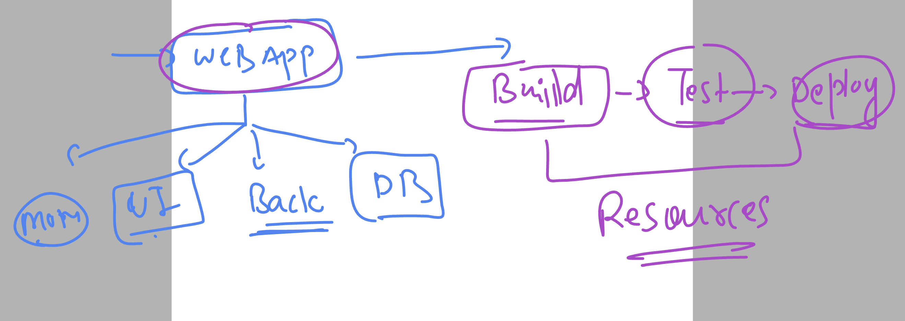
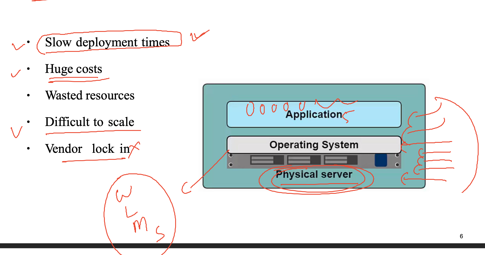

# k8s-cloud4c-b3

### Refer a webapp



### problem with bare-metal / physical server 



### testing or running multiple app in same host OS 


## problem with virutal machine for developers


### Introduction to containers 


### containers can by created and managed by various platforms 


## Docker installation 


## yes to Docker desktop on developer side


### COnnecting to remote server using ssh 

```
PS C:\Users\humanfirmware> ssh
usage: ssh [-46AaCfGgKkMNnqsTtVvXxYy] [-B bind_interface]
           [-b bind_address] [-c cipher_spec] [-D [bind_address:]port]
           [-E log_file] [-e escape_char] [-F configfile] [-I pkcs11]
           [-i identity_file] [-J [user@]host[:port]] [-L address]
           [-l login_name] [-m mac_spec] [-O ctl_cmd] [-o option] [-p port]
           [-Q query_option] [-R address] [-S ctl_path] [-W host:port]
           [-w local_tun[:remote_tun]] destination [command]
PS C:\Users\humanfirmware>
PS C:\Users\humanfirmware> ssh  ashu@43.205.161.231
The authenticity of host '43.205.161.231 (43.205.161.231)' can't be established.
ED25519 key fingerprint is SHA256:h5t+VKjGTxNKOkGzuYEFxtbts3Ye2zFOQSY8Ik1bly4.
This key is not known by any other names
Are you sure you want to continue connecting (yes/no/[fingerprint])? yes
Warning: Permanently added '43.205.161.231' (ED25519) to the list of known hosts.
ashu@43.205.161.231's password:

       __|  __|_  )
       _|  (     /   Amazon Linux 2 AMI
      ___|\___|___|

https://aws.amazon.com/amazon-linux-2/
[ashu@ip-172-31-5-47 ~]$ whoami
ashu
[ashu@ip-172-31-5-47 ~]$ uname -r
5.10.184-175.731.amzn2.x86_64
[ashu@ip-172-31-5-47 ~]$
```
