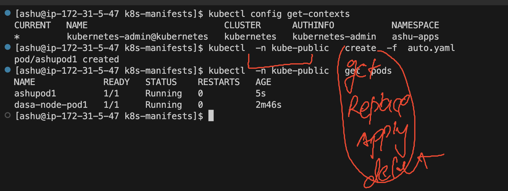

# k8s-cloud4c-b3

### Revision all the concepts

### cleaning and checking current namespace 

```
[ashu@ip-172-31-5-47 ashu-docker-images]$ kubectl  config  get-contexts 
CURRENT   NAME                          CLUSTER      AUTHINFO           NAMESPACE
*         kubernetes-admin@kubernetes   kubernetes   kubernetes-admin   ashu-apps
[ashu@ip-172-31-5-47 ashu-docker-images]$ kubectl  delete all --all
pod "busybox-pod" deleted
pod "nginx-pod" deleted
service "nginx-service" deleted
[ashu@ip-172-31-5-47 ashu-docker-images]$ 
```

### all k8s components either master or minion running on kube-system 

```
[ashu@ip-172-31-5-47 ashu-docker-images]$ kubectl   get po -n kube-system
NAME                                       READY   STATUS    RESTARTS       AGE
calico-kube-controllers-6c99c8747f-r4ghn   1/1     Running   13 (26m ago)   8d
calico-node-hm9dh                          1/1     Running   14 (25m ago)   8d
calico-node-j76x4                          1/1     Running   14 (26m ago)   8d
calico-node-jlvpf                          1/1     Running   14 (26m ago)   8d
calico-node-tbj8x                          1/1     Running   14 (26m ago)   8d
coredns-5d78c9869d-gnznw                   1/1     Running   14 (26m ago)   8d
coredns-5d78c9869d-xvgn7                   1/1     Running   14 (26m ago)   8d
etcd-masternode                            1/1     Running   14 (26m ago)   8d
kube-apiserver-masternode                  1/1     Running   14 (26m ago)   8d
kube-controller-manager-masternode         1/1     Running   14 (26m ago)   8d
```

### checking resource of other namespace

```
[ashu@ip-172-31-5-47 ashu-docker-images]$ kubectl config get-contexts 
CURRENT   NAME                          CLUSTER      AUTHINFO           NAMESPACE
*         kubernetes-admin@kubernetes   kubernetes   kubernetes-admin   ashu-apps

[ashu@ip-172-31-5-47 ashu-docker-images]$ 
[ashu@ip-172-31-5-47 ashu-docker-images]$ kubectl   get  svc
No resources found in ashu-apps namespace.

[ashu@ip-172-31-5-47 ashu-docker-images]$ kubectl   get  svc  -n kubernetes-dashboard 
NAME                        TYPE        CLUSTER-IP       EXTERNAL-IP   PORT(S)         AGE
dashboard-metrics-scraper   ClusterIP   10.101.225.208   <none>        8000/TCP        3d
kubernetes-dashboard        NodePort    10.111.8.215     <none>        443:32668/TCP   3d
[ashu@ip-172-31-5-47 ashu-docker-images]$ 

[ashu@ip-172-31-5-47 ashu-docker-images]$ 
[ashu@ip-172-31-5-47 ashu-docker-images]$ kubectl   -n  kubernetes-dashboard    get  svc
NAME                        TYPE        CLUSTER-IP       EXTERNAL-IP   PORT(S)         AGE
dashboard-metrics-scraper   ClusterIP   10.101.225.208   <none>        8000/TCP        3d
kubernetes-dashboard        NodePort    10.111.8.215     <none>        443:32668/TCP   3d


[ashu@ip-172-31-5-47 ashu-docker-images]$ kubectl   -n  kubernetes-dashboard    get  deploy
NAME                        READY   UP-TO-DATE   AVAILABLE   AGE
dashboard-metrics-scraper   1/1     1            1           3d
kubernetes-dashboard        1/1     1            1           3d


[ashu@ip-172-31-5-47 ashu-docker-images]$ kubectl   -n  kubernetes-dashboard    get  po
NAME                                         READY   STATUS    RESTARTS      AGE
dashboard-metrics-scraper-5cb4f4bb9c-b8rpp   1/1     Running   6 (44m ago)   3d
kubernetes-dashboard-6967859bff-msxh2        1/1     Running   6 (44m ago)   3d
```

### sending request of any-type to any namespace is super easy -- If you have permission 




