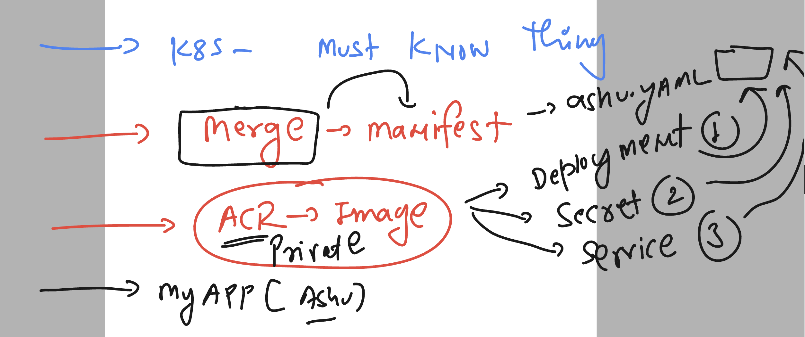

# k8s-cloud4c-b3

### Revision all the concepts

### cleaning and checking current namespace 

```
[ashu@ip-172-31-5-47 ashu-docker-images]$ kubectl  config  get-contexts 
CURRENT   NAME                          CLUSTER      AUTHINFO           NAMESPACE
*         kubernetes-admin@kubernetes   kubernetes   kubernetes-admin   ashu-apps
[ashu@ip-172-31-5-47 ashu-docker-images]$ kubectl  delete all --all
pod "busybox-pod" deleted
pod "nginx-pod" deleted
service "nginx-service" deleted
[ashu@ip-172-31-5-47 ashu-docker-images]$ 
```

### all k8s components either master or minion running on kube-system 

```
[ashu@ip-172-31-5-47 ashu-docker-images]$ kubectl   get po -n kube-system
NAME                                       READY   STATUS    RESTARTS       AGE
calico-kube-controllers-6c99c8747f-r4ghn   1/1     Running   13 (26m ago)   8d
calico-node-hm9dh                          1/1     Running   14 (25m ago)   8d
calico-node-j76x4                          1/1     Running   14 (26m ago)   8d
calico-node-jlvpf                          1/1     Running   14 (26m ago)   8d
calico-node-tbj8x                          1/1     Running   14 (26m ago)   8d
coredns-5d78c9869d-gnznw                   1/1     Running   14 (26m ago)   8d
coredns-5d78c9869d-xvgn7                   1/1     Running   14 (26m ago)   8d
etcd-masternode                            1/1     Running   14 (26m ago)   8d
kube-apiserver-masternode                  1/1     Running   14 (26m ago)   8d
kube-controller-manager-masternode         1/1     Running   14 (26m ago)   8d
```

### checking resource of other namespace

```
[ashu@ip-172-31-5-47 ashu-docker-images]$ kubectl config get-contexts 
CURRENT   NAME                          CLUSTER      AUTHINFO           NAMESPACE
*         kubernetes-admin@kubernetes   kubernetes   kubernetes-admin   ashu-apps

[ashu@ip-172-31-5-47 ashu-docker-images]$ 
[ashu@ip-172-31-5-47 ashu-docker-images]$ kubectl   get  svc
No resources found in ashu-apps namespace.

[ashu@ip-172-31-5-47 ashu-docker-images]$ kubectl   get  svc  -n kubernetes-dashboard 
NAME                        TYPE        CLUSTER-IP       EXTERNAL-IP   PORT(S)         AGE
dashboard-metrics-scraper   ClusterIP   10.101.225.208   <none>        8000/TCP        3d
kubernetes-dashboard        NodePort    10.111.8.215     <none>        443:32668/TCP   3d
[ashu@ip-172-31-5-47 ashu-docker-images]$ 

[ashu@ip-172-31-5-47 ashu-docker-images]$ 
[ashu@ip-172-31-5-47 ashu-docker-images]$ kubectl   -n  kubernetes-dashboard    get  svc
NAME                        TYPE        CLUSTER-IP       EXTERNAL-IP   PORT(S)         AGE
dashboard-metrics-scraper   ClusterIP   10.101.225.208   <none>        8000/TCP        3d
kubernetes-dashboard        NodePort    10.111.8.215     <none>        443:32668/TCP   3d


[ashu@ip-172-31-5-47 ashu-docker-images]$ kubectl   -n  kubernetes-dashboard    get  deploy
NAME                        READY   UP-TO-DATE   AVAILABLE   AGE
dashboard-metrics-scraper   1/1     1            1           3d
kubernetes-dashboard        1/1     1            1           3d


[ashu@ip-172-31-5-47 ashu-docker-images]$ kubectl   -n  kubernetes-dashboard    get  po
NAME                                         READY   STATUS    RESTARTS      AGE
dashboard-metrics-scraper-5cb4f4bb9c-b8rpp   1/1     Running   6 (44m ago)   3d
kubernetes-dashboard-6967859bff-msxh2        1/1     Running   6 (44m ago)   3d
```

### sending request of any-type to any namespace is super easy -- If you have permission 


### k8s - must know things 



## lets test -- merge manifest 

--- 
ashu.yaml
---
```
# deployment manifest 
apiVersion: apps/v1
kind: Deployment
metadata:
  creationTimestamp: null
  labels:
    app: ashu-app
  name: ashu-app
spec:
  replicas: 1
  selector:
    matchLabels:
      app: ashu-app
  strategy: {}
  template:
    metadata:
      creationTimestamp: null
      labels:
        app: ashu-app
    spec:
      containers:
      - image: cloud4c.azurecr.io/day10-web:uiv1
        name: day10-web
        ports:
        - containerPort: 80
        resources: {}
status: {}
### creating nodeport service manifest
---
apiVersion: v1
kind: Service
metadata:
  creationTimestamp: null
  labels:
    app: ashulb10
  name: ashulb10
spec:
  ports:
  - name: 80-80
    port: 80
    protocol: TCP
    targetPort: 80
  selector:
    app: ashulb10
  type: NodePort
status:
  loadBalancer: {}
# creating secretr
---
apiVersion: v1
data:
  .dockerconfigjson: eyJhdXRocyI6eyJjbG91ZDRjLmF6dXJlY3IuaW8iOnsidXNlcm5hbWUiOiJjbG91ZDRjIiwicGFzc3dvcmQiOiI5MnhQREk1cC9Qc1YzWlFKSDZhcXAybHIvYTVNZlVlczR1bXJPbnlZV0QrQUNSQ25hYmRvaGNYQXliSEl2WVRWUVVOU1EyNWhZbVJ2In19fQ==
kind: Secret
metadata:
  creationTimestamp: null
  name: ashu-img-secret
type: kubernetes.io/dockerconfigjson
```

### final manifest merge file

```
# deployment manifest 
apiVersion: apps/v1
kind: Deployment
metadata:
  creationTimestamp: null
  labels:
    app: ashu-app
  name: ashu-app
spec:
  replicas: 1
  selector:
    matchLabels:
      app: ashu-app
  strategy: {}
  template: # to create pods 
    metadata:
      creationTimestamp: null
      labels: # labels 
        app: ashu-app
    spec:
      imagePullSecrets: # calling secret 
      - name: ashu-img-secret # name of the secret 
      containers:
      - image: cloud4c.azurecr.io/day10-web:uiv1
        name: day10-web
        ports:
        - containerPort: 80
        resources: {}
status: {}
# creating nodeport service 
---
apiVersion: v1
kind: Service
metadata:
  creationTimestamp: null
  labels:
    app: ashulb10
  name: ashulb10
spec:
  ports:
  - name: 80-80
    port: 80
    protocol: TCP
    targetPort: 80
  selector: # pod finder using label of pod
    app: ashu-app # label of pod created by deployment 
  type: NodePort
status:
  loadBalancer: {}
# creating secret which will be used by deployment 
---
apiVersion: v1
data:
  .dockerconfigjson: eyJhdXRocyI6eyJjbG91ZDRjLmF6dXJlY3IuaW8iOnsidXNlcm5hbWUiOiJjbG91ZDRjIiwicGFzc3dvcmQiOiI5MnhQREk1cC9Qc1YzWlFKSDZhcXAybHIvYTVNZlVlczR1bXJPbnlZV0QrQUNSQ25hYmRvIiwiYXV0aCI6IlkyeHZkV1EwWXpvNU1uaFFSRWsxY0M5UWMxWXpXbEZLU0RaaGNYQXliSEl2WVRWTlpsVmxjelIxYlhKUGJubFpWMFFyUVVOU1EyNWhZbVJ2In19fQ==
kind: Secret
metadata:
  creationTimestamp: null
  name: ashu-img-secret # name of secret 
type: kubernetes.io/dockerconfigjson
```

### time to deploy it 

```
ashu@ip-172-31-5-47 k8s-manifests]$ kubectl  create -f ashuapp.yaml 
deployment.apps/ashu-app created
service/ashulb10 created
secret/ashu-img-secret created

[ashu@ip-172-31-5-47 k8s-manifests]$ kubectl   get  secret 
NAME              TYPE                             DATA   AGE
ashu-cred         kubernetes.io/dockerconfigjson   1      24h
ashu-img-secret   kubernetes.io/dockerconfigjson   1      12s

[ashu@ip-172-31-5-47 k8s-manifests]$ kubectl   get  svc
NAME       TYPE       CLUSTER-IP      EXTERNAL-IP   PORT(S)        AGE
ashulb10   NodePort   10.96.176.201   <none>        80:30211/TCP   20s

[ashu@ip-172-31-5-47 k8s-manifests]$ kubectl   get  deploy
NAME       READY   UP-TO-DATE   AVAILABLE   AGE
ashu-app   1/1     1            1           26s
[ashu@ip-172-31-5-47 k8s-manifests]$ kubectl   get pods
NAME                        READY   STATUS    RESTARTS   AGE
ashu-app-68fbbb4b75-qwh5m   1/1     Running   0          31s
[ashu@ip-172-31-5-47 k8s-manifests]$ 
```

