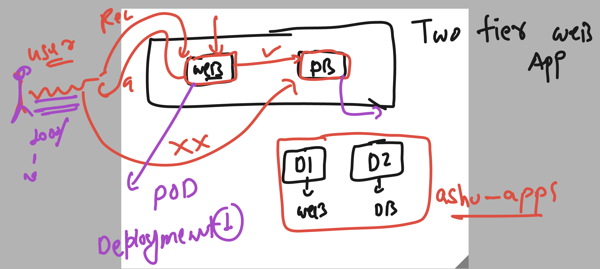

# k8s-cloud4c-b3

### Deploy a two tier web app Db and WEb ui 



### creating mysql deployment manifest 

```
kubectl  create  deployment ashu-db --image=mysql:8.0  --port=3306 --dry-run=client  -o yaml  >mysql_deploy.yaml
```


