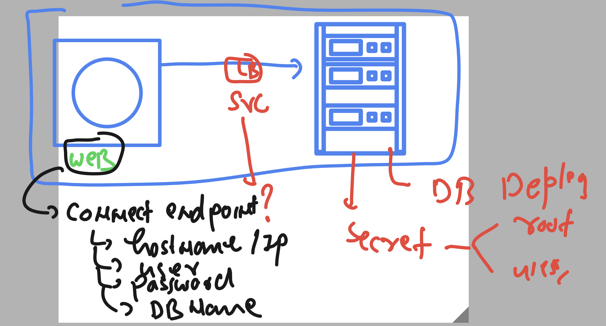
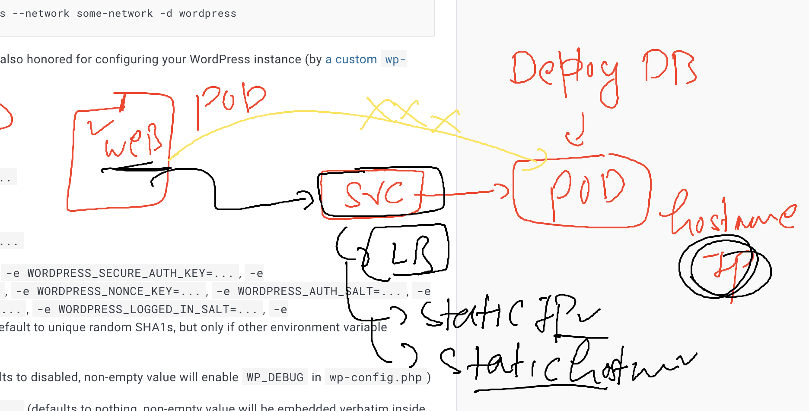
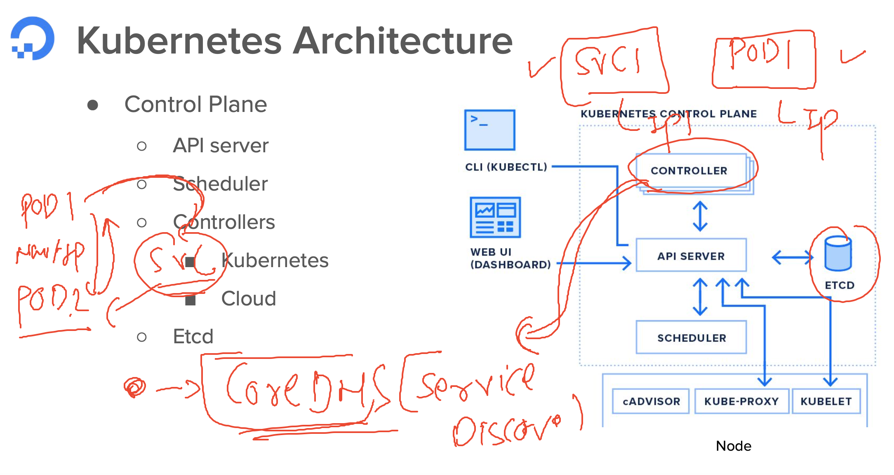
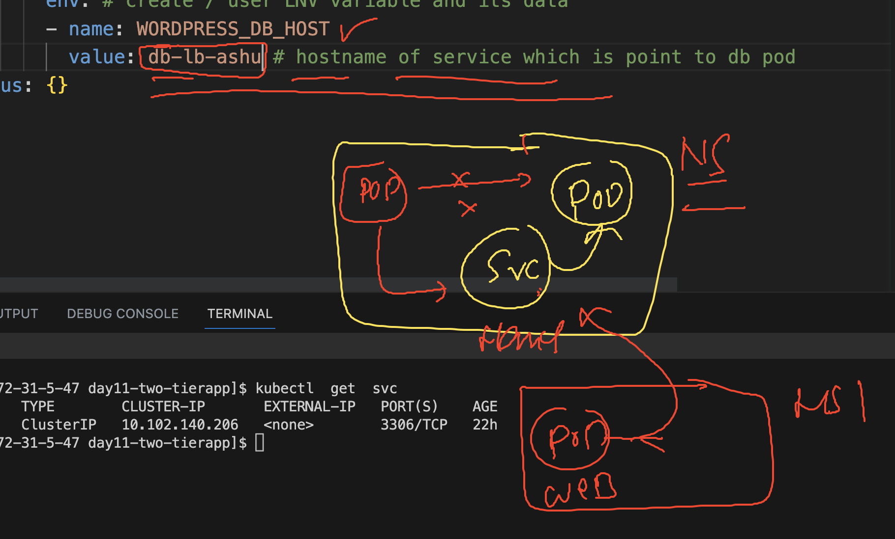

# k8s-cloud4c-b3

### Cross check things

```
[ashu@ip-172-31-5-47 ashu-docker-images]$ kubectl  config get-contexts 
CURRENT   NAME                          CLUSTER      AUTHINFO           NAMESPACE
*         kubernetes-admin@kubernetes   kubernetes   kubernetes-admin   ashu-apps

[ashu@ip-172-31-5-47 ashu-docker-images]$ kubectl  get deploy
NAME      READY   UP-TO-DATE   AVAILABLE   AGE
ashu-db   1/1     1            1           23h

[ashu@ip-172-31-5-47 ashu-docker-images]$ 
[ashu@ip-172-31-5-47 ashu-docker-images]$ kubectl  get po
NAME                       READY   STATUS    RESTARTS        AGE
ashu-db-77b6d86d6f-86ffd   1/1     Running   2 (7m14s ago)   22h

[ashu@ip-172-31-5-47 ashu-docker-images]$ 
[ashu@ip-172-31-5-47 ashu-docker-images]$ kubectl  get po -o wide
NAME                       READY   STATUS    RESTARTS        AGE   IP              NODE    NOMINATED NODE   READINESS GATES
ashu-db-77b6d86d6f-86ffd   1/1     Running   2 (7m18s ago)   22h   192.168.135.9   node3   <none>           <none>

[ashu@ip-172-31-5-47 ashu-docker-images]$ 
[ashu@ip-172-31-5-47 ashu-docker-images]$ kubectl  get  svc
NAME         TYPE        CLUSTER-IP       EXTERNAL-IP   PORT(S)    AGE
db-lb-ashu   ClusterIP   10.102.140.206   <none>        3306/TCP   22h

[ashu@ip-172-31-5-47 ashu-docker-images]$ 
[ashu@ip-172-31-5-47 ashu-docker-images]$ kubectl  get  ep 
NAME         ENDPOINTS            AGE
db-lb-ashu   192.168.135.9:3306   22h

[ashu@ip-172-31-5-47 ashu-docker-images]$ kubectl  get  secret
NAME               TYPE     DATA   AGE
ashudb-root-pass   Opaque   1      23h
ashudb-user-pass   Opaque   2      22h
[ashu@ip-172-31-5-47 ashu-docker-images]$ 
```
## Webapplication deployment 

### Creating deployment manifest for webapp

```
[ashu@ip-172-31-5-47 ashu-docker-images]$ ls
components.yaml  day11-two-tierapp  java-app  k8s-manifests  labs_done.txt  new-webapp  node-app  python-app  webui-app
[ashu@ip-172-31-5-47 ashu-docker-images]$ cd day11-two-tierapp/

[ashu@ip-172-31-5-47 day11-two-tierapp]$ ls
dbsvc.yaml  general-user-pass-secret.yaml  mysql_deploy.yaml  secret_root.yaml

[ashu@ip-172-31-5-47 day11-two-tierapp]$ kubectl  create deployment  ashu-web --image=wordpress:6.2.1-apache  --port 80 --dry-run=client -o yaml  >webapp.yaml 
```

### web need db configuration / endpoint to connect



### understanding connection details



### CoreDns as DNS / service discovery in k8s 



### verify coredns

```
[ashu@ip-172-31-5-47 day11-two-tierapp]$ kubectl  get po -n kube-system 
NAME                                       READY   STATUS    RESTARTS       AGE
calico-kube-controllers-6c99c8747f-r4ghn   1/1     Running   17 (29m ago)   12d
calico-node-hm9dh                          1/1     Running   18 (29m ago)   12d
calico-node-j76x4                          1/1     Running   18 (29m ago)   12d
calico-node-jlvpf                          1/1     Running   18 (29m ago)   12d
calico-node-tbj8x                          1/1     Running   18 (29m ago)   12d
coredns-5d78c9869d-gnznw                   1/1     Running   18 (29m ago)   12d
coredns-5d78c9869d-xvgn7                   1/1     Running   18 (29m ago)   12d
etcd-masternode                            1/1     Running   18 (29m ago)   12d
kube-apiserver-masternode                  1/1     Running   18 (29m ago)   12d
kube-controller-manager-masternode         1/1     Running   18 (29m ago)   12d
kube-proxy-kl48v                           1/1     Running   18 (29m ago)   12d
kube-proxy-mmdbp                           1/1     Running   18 (29m ago)   12d
kube-proxy-s9wz8                           1/1     Running   18 (29m ago)   12d
kube-proxy-thgmh                           1/1     Running   18 (29m ago)   12d
kube-scheduler-masternode                  1/1     Running   18 (29m ago)   12d
metrics-server-6df6656494-brdql            1/1     Running   10 (29m ago)   7d1h
[ashu@ip-172-31-5-47 day11-two-tierapp]$ kubectl  get deploy  -n kube-system 
NAME                      READY   UP-TO-DATE   AVAILABLE   AGE
calico-kube-controllers   1/1     1            1           12d
coredns                   2/2     2            2           12d
```

### checking dns entry 

```
[ashu@ip-172-31-5-47 day11-two-tierapp]$ kubectl   get  po 
NAME                       READY   STATUS    RESTARTS      AGE
ashu-db-77b6d86d6f-86ffd   1/1     Running   2 (33m ago)   23h
[ashu@ip-172-31-5-47 day11-two-tierapp]$ 
[ashu@ip-172-31-5-47 day11-two-tierapp]$ kubectl  exec -it ashu-db-77b6d86d6f-86ffd -- bash 
bash-4.4# 
bash-4.4# cat  /etc/resolv.conf 
search ashu-apps.svc.cluster.local svc.cluster.local cluster.local ap-south-1.compute.internal
nameserver 10.96.0.10
options ndots:5
bash-4.4# 
bash-4.4# 

```

### Pod to pod connection using IP address 

```
[ashu@ip-172-31-5-47 day11-two-tierapp]$ kubectl  get po
NAME                       READY   STATUS    RESTARTS      AGE
ashu-db-77b6d86d6f-86ffd   1/1     Running   2 (37m ago)   23h
[ashu@ip-172-31-5-47 day11-two-tierapp]$ kubectl  get po -o wide 
NAME                       READY   STATUS    RESTARTS      AGE   IP              NODE    NOMINATED NODE   READINESS GATES
ashu-db-77b6d86d6f-86ffd   1/1     Running   2 (37m ago)   23h   192.168.135.9   node3   <none>           <none>
[ashu@ip-172-31-5-47 day11-two-tierapp]$ 
[ashu@ip-172-31-5-47 day11-two-tierapp]$ 
[ashu@ip-172-31-5-47 day11-two-tierapp]$ kubectl  run test-connect --image=alpine --command sleep 1000 
pod/test-connect created
[ashu@ip-172-31-5-47 day11-two-tierapp]$ kubectl  get po
NAME                       READY   STATUS    RESTARTS      AGE
ashu-db-77b6d86d6f-86ffd   1/1     Running   2 (38m ago)   23h
test-connect               1/1     Running   0             5s
[ashu@ip-172-31-5-47 day11-two-tierapp]$ kubectl   exec -it test-connect  -- sh 
/ # ping 192.168.135.9 
PING 192.168.135.9 (192.168.135.9): 56 data bytes
64 bytes from 192.168.135.9: seq=0 ttl=63 time=0.144 ms
64 bytes from 192.168.135.9: seq=1 ttl=63 time=0.090 ms
^C
--- 192.168.135.9 ping statistics ---
2 packets transmitted, 2 packets received, 0% packet loss
round-trip min/avg/max = 0.090/0.117/0.144 ms
/ # 
```

### pod to pod using pod DNS entry by coreDNS

```
[ashu@ip-172-31-5-47 day11-two-tierapp]$ kubectl  get po -o wide 
NAME                       READY   STATUS    RESTARTS      AGE     IP               NODE    NOMINATED NODE   READINESS GATES
ashu-db-77b6d86d6f-86ffd   1/1     Running   2 (42m ago)   23h     192.168.135.9    node3   <none>           <none>
test-connect               1/1     Running   0             4m37s   192.168.135.51   node3   <none>           <none>
[ashu@ip-172-31-5-47 day11-two-tierapp]$

[ashu@ip-172-31-5-47 day11-two-tierapp]$ kubectl   exec -it test-connect  -- sh 
/ # 
/ # ping  192-168-135-9.ashu-apps.pod.cluster.local
PING 192-168-135-9.ashu-apps.pod.cluster.local (192.168.135.9): 56 data bytes
64 bytes from 192.168.135.9: seq=0 ttl=63 time=0.053 ms
64 bytes from 192.168.135.9: seq=1 ttl=63 time=0.091 ms
64 bytes from 192.168.135.9: seq=2 ttl=63 time=0.092 ms
^C
--- 192-168-135-9.ashu-apps.pod.cluster.local ping statistics ---
3 packets transmitted, 3 packets received, 0% packet loss
round-trip min/avg/max = 0.053/0.078/0.092 ms
/ # exit
[ashu@ip-172-31-5-47 day11-two-tierapp]$

```

## Time to configure webapp manifest to DB connection 



### updating hostname and password 

```
apiVersion: apps/v1
kind: Deployment
metadata:
  creationTimestamp: null
  labels:
    app: ashu-web
  name: ashu-web
spec:
  replicas: 1
  selector:
    matchLabels:
      app: ashu-web
  strategy: {}
  template:
    metadata:
      creationTimestamp: null
      labels:
        app: ashu-web
    spec:
      containers:
      - image: wordpress:6.2.1-apache
        name: wordpress
        ports:
        - containerPort: 80
        resources: {}
        env: # create / user ENV variable and its data 
        - name: WORDPRESS_DB_HOST
          value: db-lb-ashu # hostname of service which is point to db pod 
        - name: WORDPRESS_DB_PASSWORD # web to connect db using admin cred
          valueFrom:
            secretKeyRef:
              name: ashudb-root-pass
              key: mydbpass
status: {}

```


