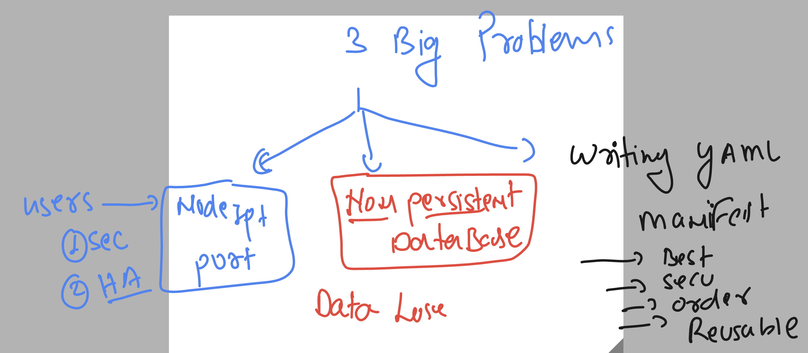
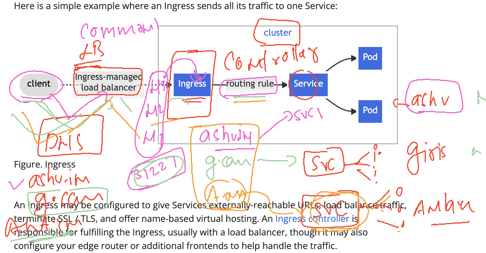
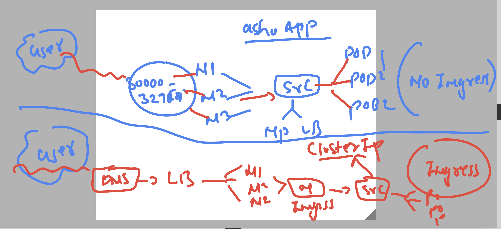
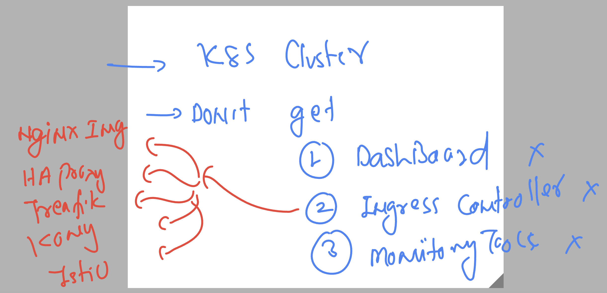

# k8s-cloud4c-b3

### understanding problem 



### Never ever share minion/worker IP to end users -- UsE External LB -- 


## Introducing Ingress controller in k8s to receive all the traffic first of any app of any NS 



### Understanding service type usage with and without Ingress 



### options of product to be deployed as Ingress controller 



### deploy nginx ingress to k8s cluster 

```
[ashu@ip-172-31-5-47 ashu-docker-images]$ kubectl  create -f https://raw.githubusercontent.com/kubernetes/ingress-nginx/main/deploy/static/provider/baremetal/deploy.yaml
namespace/ingress-nginx created
serviceaccount/ingress-nginx created
serviceaccount/ingress-nginx-admission created
role.rbac.authorization.k8s.io/ingress-nginx created
role.rbac.authorization.k8s.io/ingress-nginx-admission created
clusterrole.rbac.authorization.k8s.io/ingress-nginx created
clusterrole.rbac.authorization.k8s.io/ingress-nginx-admission created
rolebinding.rbac.authorization.k8s.io/ingress-nginx created
rolebinding.rbac.authorization.k8s.io/ingress-nginx-admission created
clusterrolebinding.rbac.authorization.k8s.io/ingress-nginx created
clusterrolebinding.rbac.authorization.k8s.io/ingress-nginx-admission created
configmap/ingress-nginx-controller created
service/ingress-nginx-controller created
service/ingress-nginx-controller-admission created
deployment.apps/ingress-nginx-controller created
job.batch/ingress-nginx-admission-create created
job.batch/ingress-nginx-admission-patch created
ingressclass.networking.k8s.io/nginx created
validatingwebhookconfiguration.admissionregistration.k8s.io/ingress-nginx-admission created
[ashu@ip-172-31-5-47 ashu-docker-images]$ 

```

### verify 

```
[ashu@ip-172-31-5-47 ashu-docker-images]$ kubectl   get  ns  | grep ingress
ingress-nginx          Active   36s

===>
[ashu@ip-172-31-5-47 ashu-docker-images]$ kubectl  -n ingress-nginx   get deploy
NAME                       READY   UP-TO-DATE   AVAILABLE   AGE
ingress-nginx-controller   1/1     1            1           57s

[ashu@ip-172-31-5-47 ashu-docker-images]$ 
[ashu@ip-172-31-5-47 ashu-docker-images]$ kubectl  -n ingress-nginx   get  secret
NAME                      TYPE     DATA   AGE
ingress-nginx-admission   Opaque   3      65s

[ashu@ip-172-31-5-47 ashu-docker-images]$ kubectl  -n ingress-nginx   get  cm
NAME                       DATA   AGE
ingress-nginx-controller   1      74s
kube-root-ca.crt           1      74s

[ashu@ip-172-31-5-47 ashu-docker-images]$ kubectl  -n ingress-nginx   get  svc
NAME                                 TYPE        CLUSTER-IP      EXTERNAL-IP   PORT(S)                      AGE
ingress-nginx-controller             NodePort    10.106.232.27   <none>        80:32576/TCP,443:31112/TCP   77s
ingress-nginx-controller-admission   ClusterIP   10.98.51.224    <none>        443/TCP                      77s
[ashu@ip-172-31-5-47 ashu-docker-images]$ 

```

