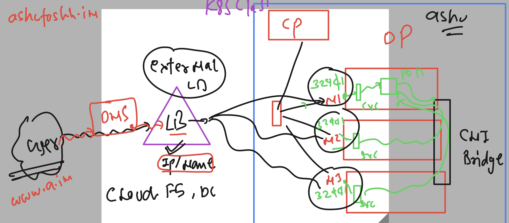

# k8s-cloud4c-b3

### understanding problem 


### Never ever share minion/worker IP to end users -- UsE External LB -- 



## Introducing Ingress controller in k8s to receive all the traffic first of any app of any NS 


### Understanding service type usage with and without Ingress 


### options of product to be deployed as Ingress controller 


### deploy nginx ingress to k8s cluster 

```
[ashu@ip-172-31-5-47 ashu-docker-images]$ kubectl  create -f https://raw.githubusercontent.com/kubernetes/ingress-nginx/main/deploy/static/provider/baremetal/deploy.yaml
namespace/ingress-nginx created
serviceaccount/ingress-nginx created
serviceaccount/ingress-nginx-admission created
role.rbac.authorization.k8s.io/ingress-nginx created
role.rbac.authorization.k8s.io/ingress-nginx-admission created
clusterrole.rbac.authorization.k8s.io/ingress-nginx created
clusterrole.rbac.authorization.k8s.io/ingress-nginx-admission created
rolebinding.rbac.authorization.k8s.io/ingress-nginx created
rolebinding.rbac.authorization.k8s.io/ingress-nginx-admission created
clusterrolebinding.rbac.authorization.k8s.io/ingress-nginx created
clusterrolebinding.rbac.authorization.k8s.io/ingress-nginx-admission created
configmap/ingress-nginx-controller created
service/ingress-nginx-controller created
service/ingress-nginx-controller-admission created
deployment.apps/ingress-nginx-controller created
job.batch/ingress-nginx-admission-create created
job.batch/ingress-nginx-admission-patch created
ingressclass.networking.k8s.io/nginx created
validatingwebhookconfiguration.admissionregistration.k8s.io/ingress-nginx-admission created
[ashu@ip-172-31-5-47 ashu-docker-images]$ 

```

### verify 

```
[ashu@ip-172-31-5-47 ashu-docker-images]$ kubectl   get  ns  | grep ingress
ingress-nginx          Active   36s

===>
[ashu@ip-172-31-5-47 ashu-docker-images]$ kubectl  -n ingress-nginx   get deploy
NAME                       READY   UP-TO-DATE   AVAILABLE   AGE
ingress-nginx-controller   1/1     1            1           57s

[ashu@ip-172-31-5-47 ashu-docker-images]$ 
[ashu@ip-172-31-5-47 ashu-docker-images]$ kubectl  -n ingress-nginx   get  secret
NAME                      TYPE     DATA   AGE
ingress-nginx-admission   Opaque   3      65s

[ashu@ip-172-31-5-47 ashu-docker-images]$ kubectl  -n ingress-nginx   get  cm
NAME                       DATA   AGE
ingress-nginx-controller   1      74s
kube-root-ca.crt           1      74s

[ashu@ip-172-31-5-47 ashu-docker-images]$ kubectl  -n ingress-nginx   get  svc
NAME                                 TYPE        CLUSTER-IP      EXTERNAL-IP   PORT(S)                      AGE
ingress-nginx-controller             NodePort    10.106.232.27   <none>        80:32576/TCP,443:31112/TCP   77s
ingress-nginx-controller-admission   ClusterIP   10.98.51.224    <none>        443/TCP                      77s
[ashu@ip-172-31-5-47 ashu-docker-images]$ 

```

### testing ingress controller by 

```
mkdir  day13-ingress-test
[ashu@ip-172-31-5-47 ashu-docker-images]$ cd day13-ingress-test/

ashu@ip-172-31-5-47 day13-ingress-test]$ kubectl  create  deployment ashu-ui --image=dockerashu/reactapp:version1 --port 3000 --dry-run=client -o yaml    >deployweb.yaml

===>
[ashu@ip-172-31-5-47 day13-ingress-test]$ ls
deployweb.yaml
[ashu@ip-172-31-5-47 day13-ingress-test]$ kubectl  create -f  deployweb.yaml 
deployment.apps/ashu-ui created
[ashu@ip-172-31-5-47 day13-ingress-test]$ kubectl  get  deploy
NAME      READY   UP-TO-DATE   AVAILABLE   AGE
ashu-ui   0/1     1            0           4s
[ashu@ip-172-31-5-47 day13-ingress-test]$ kubectl  get  po
NAME                       READY   STATUS    RESTARTS   AGE
ashu-ui-56ff7756dd-ltrgg   1/1     Running   0          6s
[ashu@ip-172-31-5-47 day13-ingress-test]$

```

### creating clusterIP type service

```
[ashu@ip-172-31-5-47 day13-ingress-test]$ kubectl  get deploy
NAME      READY   UP-TO-DATE   AVAILABLE   AGE
ashu-ui   1/1     1            1           63s
[ashu@ip-172-31-5-47 day13-ingress-test]$ 
[ashu@ip-172-31-5-47 day13-ingress-test]$ kubectl   expose  deployment  ashu-ui  --type ClusterIP --port 3000 --name ashusvc1   --dry-run=client -o yaml >svc.yaml

[ashu@ip-172-31-5-47 day13-ingress-test]$ kubectl  create -f svc.yaml 
service/ashusvc1 created

[ashu@ip-172-31-5-47 day13-ingress-test]$ kubectl  get svc
NAME       TYPE        CLUSTER-IP      EXTERNAL-IP   PORT(S)    AGE
ashusvc1   ClusterIP   10.106.137.53   <none>        3000/TCP   3s
[ashu@ip-172-31-5-47 day13-ingress-test]$ 
```

### adding ingress manifest 

```
apiVersion: networking.k8s.io/v1
kind: Ingress
metadata:
  name: ashu-app-routing-rule # name of my routing rule 
  annotations:
    nginx.ingress.kubernetes.io/rewrite-target: /
spec:
  ingressClassName: nginx # class name is nginx 
  rules:
  - host: me.ashutoshh.in # domain of webapp
    http:
      paths:
      - path: / # app home page in / 
        pathType: Prefix
        backend:
          service:
            name: ashusvc1 # name of service 
            port:
              number: 3000 
```

### deploy routing rule

```
[ashu@ip-172-31-5-47 day13-ingress-test]$ kubectl  create -f ingress.yaml 
ingress.networking.k8s.io/ashu-app-routing-rule created
[ashu@ip-172-31-5-47 day13-ingress-test]$ kubectl  get  ingress
NAME                    CLASS   HOSTS             ADDRESS       PORTS   AGE
ashu-app-routing-rule   nginx   me.ashutoshh.in   172.31.0.13   80      5s
[ashu@ip-172-31-5-47 day13-ingress-test]$ 

```


