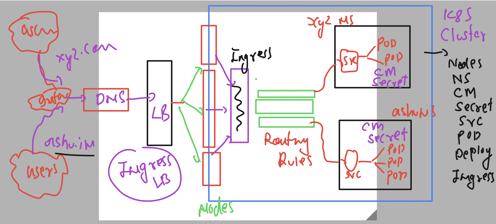
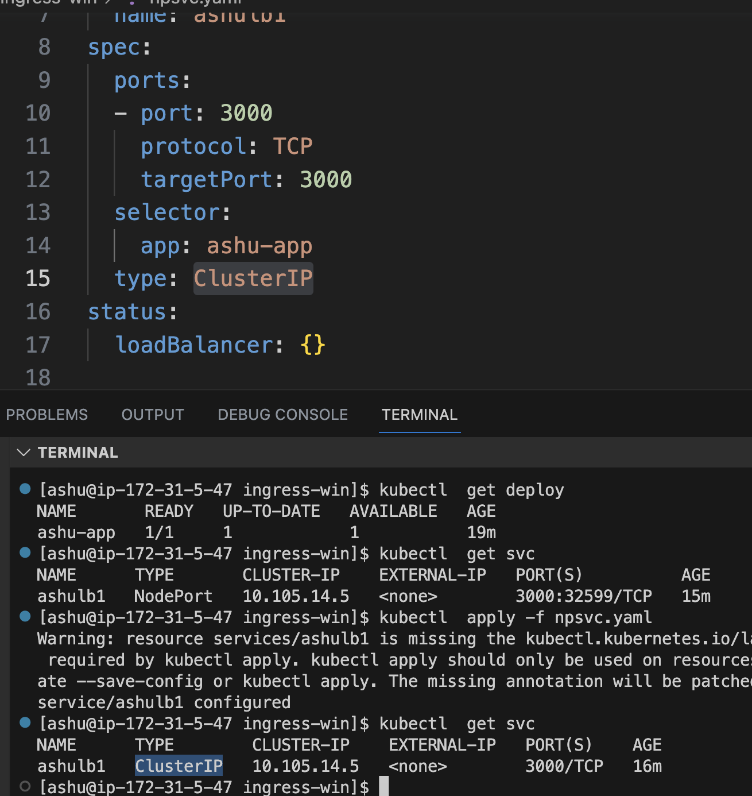

# k8s-cloud4c-b3

## Simplify k8s 



## Ingress controller again 

### cleaning up all namespace content 

```
kubectl  delete all,cm,secret,ingress --all
```

### creating deployment controller for react app

```
[ashu@ip-172-31-5-47 ashu-docker-images]$ mkdir  ingress-win
[ashu@ip-172-31-5-47 ashu-docker-images]$ cd ingress-win/
[ashu@ip-172-31-5-47 ingress-win]$ ls
[ashu@ip-172-31-5-47 ingress-win]$ kubectl create  deployment  ashu-app --image=dockerashu/reactapp:version1 --port 3000  --dry-run=client -o yaml  >deploy.yaml 
[ashu@ip-172-31-5-47 ingress-win]$ 

```

### deploy manifest

```
[ashu@ip-172-31-5-47 ingress-win]$ kubectl  apply -f  deploy.yaml 
deployment.apps/ashu-app created
[ashu@ip-172-31-5-47 ingress-win]$ kubectl  get  deploy
NAME       READY   UP-TO-DATE   AVAILABLE   AGE
ashu-app   1/1     1            1           8s
[ashu@ip-172-31-5-47 ingress-win]$ kubectl  get po
NAME                       READY   STATUS    RESTARTS   AGE
ashu-app-cbdc6cf79-mgrtg   1/1     Running   0          10s
[ashu@ip-172-31-5-47 ingress-win]$ 
```

### creating Np/LB service to expose app outside k8s cluster

```
[ashu@ip-172-31-5-47 ingress-win]$ kubectl  get  deploy
NAME       READY   UP-TO-DATE   AVAILABLE   AGE
ashu-app   1/1     1            1           3m29s
[ashu@ip-172-31-5-47 ingress-win]$ kubectl  expose deployment ashu-app --type NodePort --port 3000 --name ashulb1 --dry-run=client -o yaml >npsvc.yaml 
[ashu@ip-172-31-5-47 ingress-win]$ kubectl  create -f npsvc.yaml 
service/ashulb1 created
[ashu@ip-172-31-5-47 ingress-win]$ kubectl  get  svc
NAME      TYPE       CLUSTER-IP    EXTERNAL-IP   PORT(S)          AGE
ashulb1   NodePort   10.105.14.5   <none>        3000:32599/TCP   3s
[ashu@ip-172-31-5-47 ingress-win]$ 
```

### Because Ingress controller is bringing traffic to inside k8s cluster so we never have to expose webapp outside 



### making changes

```
apiVersion: networking.k8s.io/v1
kind: Ingress
metadata:
  name: ashu-app-route # name of ingress
  annotations:
    nginx.ingress.kubernetes.io/rewrite-target: /
spec:
  ingressClassName: nginx # class
  rules:
  - host: me.ashutoshh.in # url of your app
    http:
      paths:
      - path: /  # home page
        pathType: Prefix
        backend:
          service:
            name: ashulb1 # name of svc
            port:
              number: 3000
```

### 

```
[ashu@ip-172-31-5-47 ingress-win]$ kubectl  apply -f route.yaml 
ingress.networking.k8s.io/ashu-app-route created
[ashu@ip-172-31-5-47 ingress-win]$ kubectl  get ingress
NAME             CLASS   HOSTS             ADDRESS   PORTS   AGE
ashu-app-route   nginx   me.ashutoshh.in             80      5s
[ashu@ip-172-31-5-47 ingress-win]$ 
```
### splunk solution 

```
  kubectl  create  deployment splunk1 --image=splunk/splunk:latest --port 8000 --dry-run=client -o yaml >splk.yaml 
  944  kubectl  create configmap  licen  --from-literal  my-pic="--accept-license" --dry-run=client -o yaml >cm.yaml 
  945  kubectl  apply -f cm.yaml 
  946  kubectl  get cm
  947  kubectl  create secret  generic  sec1 --from-literal mypass="Docker@12344" --dry-run=client -o yaml >secret.yaml
  948  kubectl  create -f secret.yaml 
  949  kubectl  get cm
  950  kubectl  get secret
  951  kubectl  apply -f splk.yaml 
  952  kubectl  get deploy
  953  kubectl  get po
  954  kubectl  get deploy
  955  kubectl  expose deployment splunk1 --type NodePort --port 8000 --dry-run=client -o yaml >spsvc.yaml
  956  kubectl  apply -f spsvc.yaml 
```


