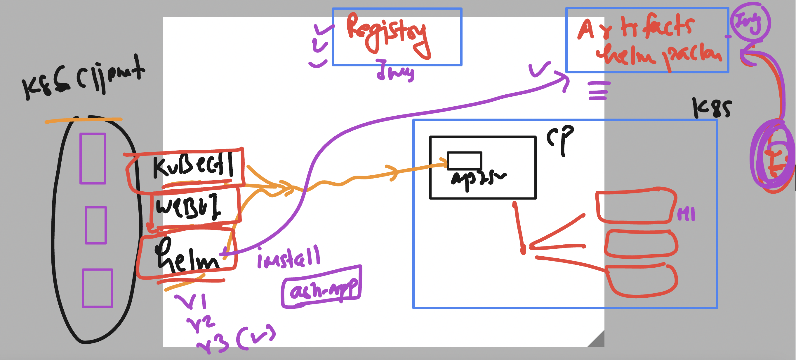
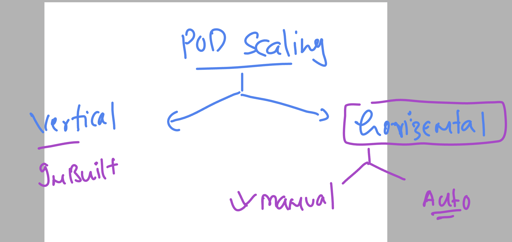
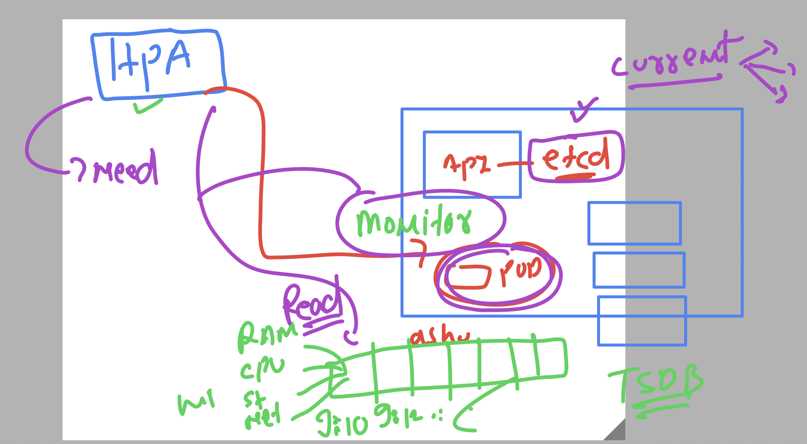
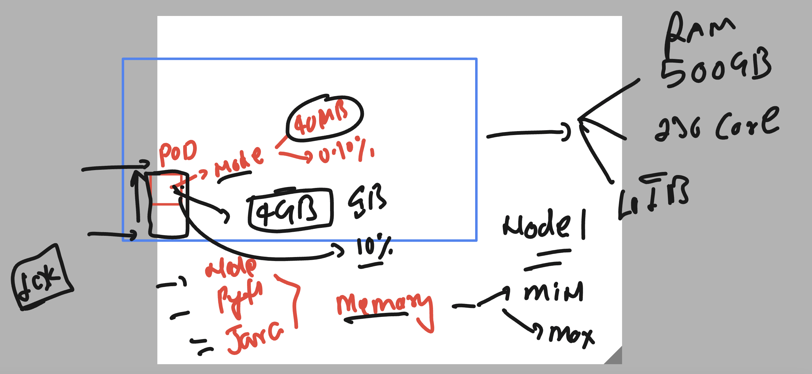

# k8s-cloud4c-b3

## enable auto completion in kubectl on bash shell

```
source <(kubectl completion bash)

echo "source <(kubectl completion bash)" >> ~/.bashrc
```

### Helm introduction 


### Overall helm 



## First step to add repo url 

```
[ashu@ip-172-31-5-47 ashu-docker-images]$ helm repo ls
NAME                    URL                                               
prometheus-community    https://prometheus-community.github.io/helm-charts
ashu-repo1              https://charts.helm.sh/stable                     
[ashu@ip-172-31-5-47 ashu-docker-images]$ 
[ashu@ip-172-31-5-47 ashu-docker-images]$ 
[ashu@ip-172-31-5-47 ashu-docker-images]$ helm repo add ashu-repo2 https://charts.bitnami.com/bitnami
"ashu-repo2" has been added to your repositories
[ashu@ip-172-31-5-47 ashu-docker-images]$ 
[ashu@ip-172-31-5-47 ashu-docker-images]$ 
[ashu@ip-172-31-5-47 ashu-docker-images]$ helm repo ls
NAME                    URL                                               
prometheus-community    https://prometheus-community.github.io/helm-charts
ashu-repo1              https://charts.helm.sh/stable                     
ashu-repo2              https://charts.bitnami.com/bitnami                
[ashu@ip-172-31-5-47 ashu-docker-images]$ 

```

### searching packages in helm 

```
[ashu@ip-172-31-5-47 ashu-docker-images]$ helm search repo  nginx 
NAME                                            CHART VERSION   APP VERSION     DESCRIPTION                                       
ashu-repo1/nginx-ingress                        1.41.3          v0.34.1         DEPRECATED! An nginx Ingress controller that us...
ashu-repo1/nginx-ldapauth-proxy                 0.1.6           1.13.5          DEPRECATED - nginx proxy with ldapauth            
ashu-repo1/nginx-lego                           0.3.1                           Chart for nginx-ingress-controller and kube-lego  
ashu-repo2/nginx                                15.1.2          1.25.1          NGINX Open Source is a web server that can be a...
ashu-repo2/nginx-ingress-controller             9.7.7           1.8.1           NGINX Ingress Controller is an Ingress controll...
ashu-repo2/nginx-intel                          2.1.15          0.4.9           DEPRECATED NGINX Open Source for Intel is a lig...
prometheus-community/prometheus-nginx-exporter  0.1.1           0.11.0          A Helm chart for the Prometheus NGINX Exporter    
ashu-repo1/gcloud-endpoints                     0.1.2           1               DEPRECATED Develop, deploy, protect and monitor...
[ashu@ip-172-31-5-47 ashu-docker-images]$ 

```

### deploy package in k8s 

```
[ashu@ip-172-31-5-47 ashu-docker-images]$ helm install  ashu-webapp   ashu-repo2/nginx 
NAME: ashu-webapp
LAST DEPLOYED: Fri Aug  4 04:18:58 2023
NAMESPACE: ashu-apps
STATUS: deployed
REVISION: 1
TEST SUITE: None
NOTES:
CHART NAME: nginx
CHART VERSION: 15.1.2
APP VERSION: 1.25.1

```

### verify deploy status

```
[ashu@ip-172-31-5-47 ashu-docker-images]$ helm  ls
NAME            NAMESPACE       REVISION        UPDATED                                 STATUS          CHART           APP VERSION
ashu-webapp     ashu-apps       1               2023-08-04 04:18:58.794325343 +0000 UTC deployed        nginx-15.1.2    1.25.1     
[ashu@ip-172-31-5-47 ashu-docker-images]$ 
```

### uninstall -- deleting 

```
ashu@ip-172-31-5-47 ashu-docker-images]$ helm ls
NAME            NAMESPACE       REVISION        UPDATED                                 STATUS          CHART           APP VERSION
ashu-webapp     ashu-apps       1               2023-08-04 04:18:58.794325343 +0000 UTC deployed        nginx-15.1.2    1.25.1     
[ashu@ip-172-31-5-47 ashu-docker-images]$ 
[ashu@ip-172-31-5-47 ashu-docker-images]$ 
[ashu@ip-172-31-5-47 ashu-docker-images]$ helm uninstall  ashu-webapp
release "ashu-webapp" uninstalled
[ashu@ip-172-31-5-47 ashu-docker-images]$ 
[ashu@ip-172-31-5-47 ashu-docker-images]$ helm ls
NAME    NAMESPACE       REVISION        UPDATED STATUS  CHART   APP VERSION
[ashu@ip-172-31-5-47 ashu-docker-images]$ 
[ashu@ip-172-31-5-47 ashu-docker-images]$ 
[ashu@ip-172-31-5-47 ashu-docker-images]$ kubectl  get  all
No resources found in ashu-apps namespace.
[ashu@ip-172-31-5-47 ashu-docker-images]$ 

```

### Pod auto scaling concept 



### HPA need some Monitoring engine which can monitor and store pod resource consumption 



## HPA --demo

### creating deployment 

```
[ashu@ip-172-31-5-47 ashu-docker-images]$ mkdir  hpa-demo
[ashu@ip-172-31-5-47 ashu-docker-images]$ cd hpa-demo/
[ashu@ip-172-31-5-47 hpa-demo]$ ls
[ashu@ip-172-31-5-47 hpa-demo]$ kubectl  create  deployment ashu-app --image=dockerashu/ashuweb-ui:app4 --port 80 --dry-run=client  -oyaml >deploy.yaml 
[ashu@ip-172-31-5-47 hpa-demo]$ ls
deploy.yaml

```

### Important to limit pod in veritical scale 



### updated manifest

```
apiVersion: apps/v1
kind: Deployment
metadata:
  creationTimestamp: null
  labels:
    app: ashu-app
  name: ashu-app
spec:
  replicas: 1
  selector:
    matchLabels:
      app: ashu-app
  strategy: {}
  template:
    metadata:
      creationTimestamp: null
      labels:
        app: ashu-app
    spec:
      containers:
      - image: dockerashu/ashuweb-ui:app4
        name: ashuweb-ui
        ports:
        - containerPort: 80
        resources: 
          requests:
            memory: 50M 
            cpu: 100m # 1 core cpu -- 1000 mili core (1000m)
          limits:
            memory: 400M 
            cpu: 200m 
status: {}

```

### creating hpa 

```
[ashu@ip-172-31-5-47 hpa-demo]$ kubectl  get  svc
NAME   TYPE       CLUSTER-IP     EXTERNAL-IP   PORT(S)        AGE
lb1    NodePort   10.107.83.19   <none>        80:32532/TCP   2m9s
[ashu@ip-172-31-5-47 hpa-demo]$ kubectl  get  deploy
NAME       READY   UP-TO-DATE   AVAILABLE   AGE
ashu-app   1/1     1            1           4m31s
[ashu@ip-172-31-5-47 hpa-demo]$ 
[ashu@ip-172-31-5-47 hpa-demo]$ kubectl  autoscale  deployment  ashu-app  --max 15 --min 2 --cpu-percent 80 --dry-run=client -o yaml >hpa.yaml 
[ashu@ip-172-31-5-47 hpa-demo]$ 
```

### deployed hpa

```
[ashu@ip-172-31-5-47 hpa-demo]$ kubectl  get po 
NAME                        READY   STATUS    RESTARTS   AGE
ashu-app-66d6cdf75b-68f7q   1/1     Running   0          7m2s
[ashu@ip-172-31-5-47 hpa-demo]$ kubectl  apply -f hpa.yaml 
horizontalpodautoscaler.autoscaling/ashu-app created
[ashu@ip-172-31-5-47 hpa-demo]$ kubectl  get  hpa
NAME       REFERENCE             TARGETS         MINPODS   MAXPODS   REPLICAS   AGE
ashu-app   Deployment/ashu-app   <unknown>/80%   2         15        0          3s
[ashu@ip-172-31-5-47 hpa-demo]$ kubectl  get po 
NAME                        READY   STATUS    RESTARTS   AGE
ashu-app-66d6cdf75b-68f7q   1/1     Running   0 
```


