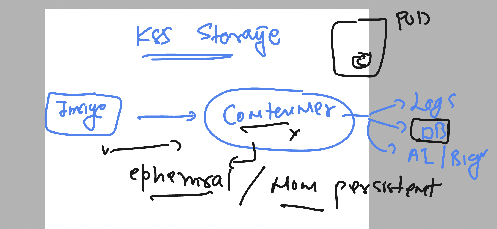
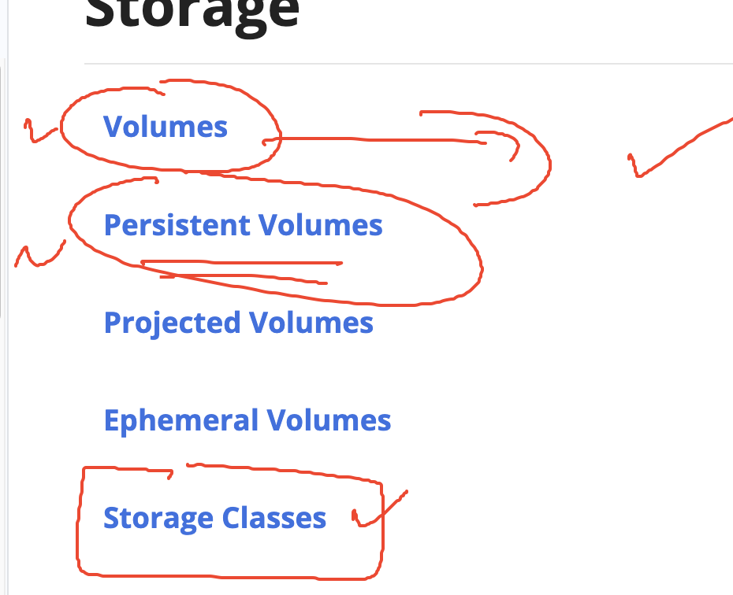
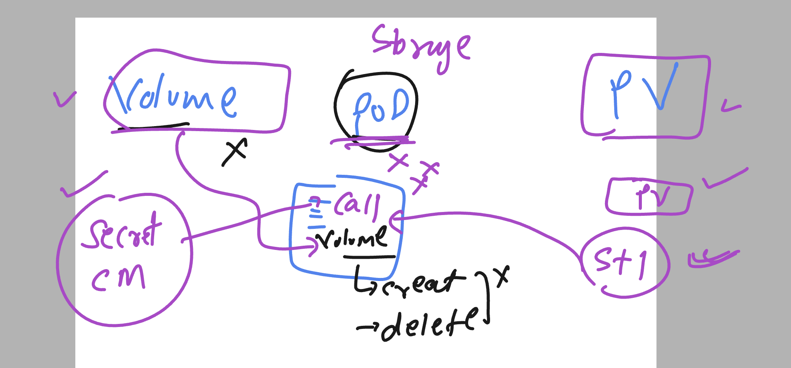

# k8s-cloud4c-b3

## COntainer are having ephemral nature by default 



### storage in k8s 



### volume vs PV 



### Creating mysql deployment without volume 

## manifests

### configmap 

```
kubectl create configmap ashu-db-cm  --from-env-file  db-details.env --dry-run=client -o yaml >cm.yaml

===db-details.env===

MYSQL_DATABASE=ashucloud4cdb

===========>
ashu@ip-172-31-5-47 day16]$ kubectl  create -f cm.yaml 
configmap/ashu-db-cm created
[ashu@ip-172-31-5-47 day16]$ kubectl  get cm
NAME               DATA   AGE
ashu-db-cm         1      3s
kube-root-ca.crt   1      2d23h
```

### secret 

```
==< db-cred.env == >
MYSQL_ROOT_PASSWORD=RootdbPass@123
MYSQL_USER=ashu
MYSQL_PASSWORD=Ashudb@098

====>>
[ashu@ip-172-31-5-47 day16]$ ls
cm.yaml  db-cred.env  db-details.env

[ashu@ip-172-31-5-47 day16]$ kubectl  create secret 
docker-registry  (Create a secret for use with a Docker registry)
generic          (Create a secret from a local file, directory, or literal value)
tls              (Create a TLS secret)

[ashu@ip-172-31-5-47 day16]$ kubectl  create secret generic  ashu-db-cred  --from-env-file  db-cred.env --dry-run=client -o yaml  >secret.yaml 
[ashu@ip-172-31-5-47 day16]$ kubectl  create -f secret.yaml 
secret/ashu-db-cred created

[ashu@ip-172-31-5-47 day16]$ kubectl  get  secrets 
NAME           TYPE     DATA   AGE
ashu-db-cred   Opaque   3      3s
[ashu@ip-172-31-5-47 day16]$ 


```

### Deployment 

```
kubectl  create deployment ashu-mysql --image=mysql:8.0 --port 3306 --dry-run=client -o yaml >deploy.yaml
====>
apiVersion: apps/v1
kind: Deployment
metadata:
  creationTimestamp: null
  labels:
    app: ashu-mysql
  name: ashu-mysql
spec:
  replicas: 1
  selector:
    matchLabels:
      app: ashu-mysql
  strategy: {}
  template:
    metadata:
      creationTimestamp: null
      labels:
        app: ashu-mysql
    spec:
      containers:
      - image: mysql:8.0
        name: mysql
        ports:
        - containerPort: 3306
        resources: {}
        envFrom:
          - secretRef:
              name: ashu-db-cred
          - configMapRef:
              name: ashu-db-cm
status: {}

====>
[ashu@ip-172-31-5-47 day16]$ kubectl  apply -f deploy.yaml 
deployment.apps/ashu-mysql created
[ashu@ip-172-31-5-47 day16]$ kubectl  get  deploy
NAME         READY   UP-TO-DATE   AVAILABLE   AGE
ashu-mysql   1/1     1            1           6s
[ashu@ip-172-31-5-47 day16]$ 
```

## to accept traffic on Db pods we can create ClusterIP type service 

```
[ashu@ip-172-31-5-47 day16]$ kubectl  get deploy
NAME         READY   UP-TO-DATE   AVAILABLE   AGE
ashu-mysql   1/1     1            1           5m46s
[ashu@ip-172-31-5-47 day16]$ kubectl  expose deployment ashu-mysql --type ClusterIP --port 3306 --name dblb1 --dry-run=client -o yaml  >svc.yaml 
[ashu@ip-172-31-5-47 day16]$ kubectl  create -f svc.yaml 
service/dblb1 created
[ashu@ip-172-31-5-47 day16]$ kubectl  get svc
NAME    TYPE        CLUSTER-IP      EXTERNAL-IP   PORT(S)    AGE
dblb1   ClusterIP   10.103.71.150   <none>        3306/TCP   4s
[ashu@ip-172-31-5-47 day16]$ 

```

### creating web db client in diff ns 

```
apiVersion: apps/v1
kind: Deployment
metadata:
  namespace: cloud4c-common # namespace where i want to deploy this
  creationTimestamp: null
  labels:
    app: ashu-app
  name: ashu-app
spec:
  replicas: 1
  selector:
    matchLabels:
      app: ashu-app
  strategy: {}
  template:
    metadata:
      creationTimestamp: null
      labels:
        app: ashu-app
    spec:
      containers:
      - image: adminer
        name: adminer
        ports:
        - containerPort: 8080
        resources: {}
status: {}
===>
[ashu@ip-172-31-5-47 day16]$ kubectl  create -f web.yaml 
deployment.apps/ashu-app created
[ashu@ip-172-31-5-47 day16]$ 
[ashu@ip-172-31-5-47 day16]$ kubectl  get  deploy
NAME         READY   UP-TO-DATE   AVAILABLE   AGE
ashu-mysql   1/1     1            1           13m
[ashu@ip-172-31-5-47 day16]$ 
[ashu@ip-172-31-5-47 day16]$ 
[ashu@ip-172-31-5-47 day16]$ kubectl  get  deploy -n cloud4c-common 
NAME         READY   UP-TO-DATE   AVAILABLE   AGE
ankita-app   0/1     1            0           6s
ashu-app     1/1     1            1           16s
nikita-app   1/1     1            1           37s
sankar-app   0/1     1            0           3s
vital-app    1/1     1            1           3s
[ashu@ip-172-31-5-47 day16]$ 

```

### creating svc

```
[ashu@ip-172-31-5-47 day16]$ kubectl  get  deploy -n cloud4c-common 
NAME         READY   UP-TO-DATE   AVAILABLE   AGE
ankita-app   1/1     1            1           3m49s
ashu-app     1/1     1            1           3m59s
chandu-app   1/1     1            1           45s
nikita-app   1/1     1            1           4m20s
ramesh-app   1/1     1            1           2m10s
sankar-app   1/1     1            1           3m46s
siva-app     1/1     1            1           12s
sne-app      1/1     1            1           2m32s
vital-app    1/1     1            1           3m46s
[ashu@ip-172-31-5-47 day16]$ kubectl  expose deployment ashu-app  --type NodePort --port 8080 --name ashu-lb1 --namespace cloud4c-common  --dry-run=client -o yaml >websvc.yaml 
[ashu@ip-172-31-5-47 day16]$ kubectl  create -f websvc.yaml 
service/ashu-lb1 created
[ashu@ip-172-31-5-47 day16]$ kubectl  get svc -n cloud4c-common 
NAME       TYPE       CLUSTER-IP     EXTERNAL-IP   PORT(S)          AGE
ashu-lb1   NodePort   10.109.4.248   <none>        8080:30203/TCP   5s
[ashu@ip-172-31-5-47 day16]$ 


```
### Problem with data persistency in container 

```
[ashu@ip-172-31-5-47 day16]$ kubectl  get  po 
NAME                          READY   STATUS    RESTARTS   AGE
ashu-mysql-66649bf557-6zmpd   1/1     Running   0          40m
[ashu@ip-172-31-5-47 day16]$ kubectl  delete pod ashu-mysql-66649bf557-6zmpd 
pod "ashu-mysql-66649bf557-6zmpd" deleted
[ashu@ip-172-31-5-47 day16]$ 
[ashu@ip-172-31-5-47 day16]$ kubectl  get  po 
NAME                          READY   STATUS    RESTARTS   AGE
ashu-mysql-66649bf557-4bv5s   1/1     Running   0          7s
[ashu@ip-172-31-5-47 day16]$ 

```


