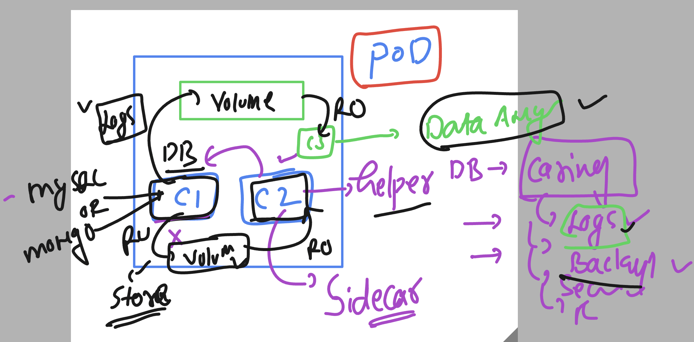
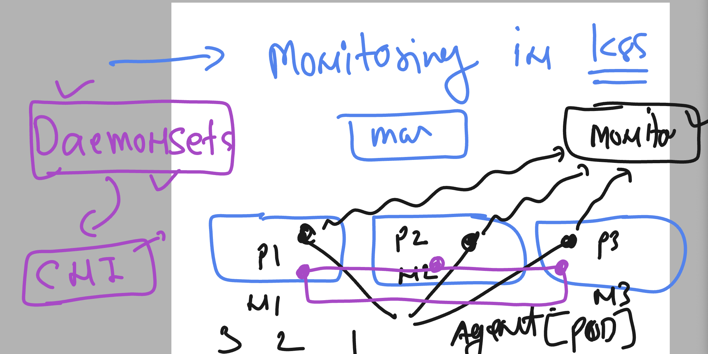

# k8s-cloud4c-b3

## Using Pv & PVC 


### Pv and PVC 


### cleaning up namespace 

```
[ashu@ip-172-31-5-47 ashu-docker-images]$ kubectl config get-contexts 
CURRENT   NAME                          CLUSTER      AUTHINFO           NAMESPACE
*         kubernetes-admin@kubernetes   kubernetes   kubernetes-admin   ashu-apps
[ashu@ip-172-31-5-47 ashu-docker-images]$ ls
components.yaml    day13-ingress-test  hpa-demo     java-app       labs_done.txt  node-app    webui-app
day11-two-tierapp  day16               ingress-win  k8s-manifests  new-webapp     python-app
[ashu@ip-172-31-5-47 ashu-docker-images]$ ls day16/
cm.yaml  db-cred.env  db-details.env  deploy.yaml  secret.yaml  svc.yaml  websvc.yaml  web.yaml
[ashu@ip-172-31-5-47 ashu-docker-images]$ 
[ashu@ip-172-31-5-47 ashu-docker-images]$ 
[ashu@ip-172-31-5-47 ashu-docker-images]$ kubectl  delete -f day16 
configmap "ashu-db-cm" deleted
deployment.apps "ashu-mysql" deleted
secret "ashu-db-cred" deleted
service "dblb1" deleted
deployment.apps "ashu-app" deleted
service "ashu-lb1" deleted
[ashu@ip-172-31-5-47 ashu-docker-images]$ kubectl  get all
No resources found in ashu-apps namespace.
[ashu@ip-172-31-5-47 ashu-docker-images]$ 
```


### Creating pv 

```
apiVersion: v1
kind: PersistentVolume
metadata:
  name: ashu-pv
spec:
  storageClassName: manual
  capacity:
    storage: 10Gi # from external source i am requesting 3Gi-10Gi 
  accessModes:
    - ReadWriteOnce
  nfs:
    path: "/data/db/ashu/"
    server: 172.31.5.47

```

### create request 

```
ashu@ip-172-31-5-47 day17]$ kubectl  create -f pv.yaml 
persistentvolume/ashu-pv created
[ashu@ip-172-31-5-47 day17]$ kubectl  get  pv
NAME         CAPACITY   ACCESS MODES   RECLAIM POLICY   STATUS      CLAIM                     STORAGECLASS   REASON   AGE
ankita-pv    4Gi        RWO            Retain           Available                             manual                  4s
ashu-pv      10Gi       RWO            Retain           Available                             manual                  8s
```

### creating PVC

```
apiVersion: v1
kind: PersistentVolumeClaim
metadata:
  name: ashu-db-claim
spec:
  storageClassName: manual
  accessModes:
    - ReadWriteMany
  resources:
    requests:
      storage: 3Gi # need of storage for my app 

```

===>

```
ashu@ip-172-31-5-47 day17]$ kubectl apply -f pvc.yaml
[ashu@ip-172-31-5-47 day17]$ kubectl  get  pvc
NAME            STATUS   VOLUME     CAPACITY   ACCESS MODES   STORAGECLASS   AGE
ashu-db-claim   Bound    vital-pv   3Gi        RWX            manual         58s
```

### deployment -- manifest 

```
apiVersion: apps/v1
kind: Deployment
metadata:
  creationTimestamp: null
  labels:
    app: ashu-mysql
  name: ashu-mysql
spec:
  replicas: 1
  selector:
    matchLabels:
      app: ashu-mysql
  strategy: {}
  template:
    metadata:
      creationTimestamp: null
      labels:
        app: ashu-mysql
    spec:
      nodeName: node1 # creating pod in node1 only 
      volumes: # creating volume internally 
      - name: ashu-db-volnew
        persistentVolumeClaim: # calling pvc 
          claimName: ashu-db-claim # name of pvc 
      containers:
      - image: mysql:8.0
        name: mysql
        ports:
        - containerPort: 3306
        resources: {}
        envFrom:
          - secretRef:
              name: ashu-db-cred
          - configMapRef:
              name: ashu-db-cm
        volumeMounts: # for attaching storage to the container
        - name: ashu-db-volnew
          mountPath: /var/lib/mysql/
status: {}

```

### creating 

```
[ashu@ip-172-31-5-47 day17]$ kubectl  create -f cm.yaml -f secret.yaml 
configmap/ashu-db-cm created
secret/ashu-db-cred created
[ashu@ip-172-31-5-47 day17]$ kubectl create -f deploy.yaml 
deployment.apps/ashu-mysql created
[ashu@ip-172-31-5-47 day17]$ kubectl  get deploy
NAME         READY   UP-TO-DATE   AVAILABLE   AGE
ashu-mysql   1/1     1            1           4s
[ashu@ip-172-31-5-47 day17]$ 
```

## Multi container pod -- sidecar container 



## manifest

```
apiVersion: v1
kind: Pod
metadata:
  creationTimestamp: null
  labels:
    run: ashu-pod17
  name: ashu-pod17
spec:
  volumes: # creating volume 
  - name: ashu-log-volume
    emptyDir: {} # random location for testing purpose 
  containers:
  - image: alpine 
    name: ashu-data-genc 
    volumeMounts:  # mounting above created volume 
    - name: ashu-log-volume
      mountPath: /mnt/data-gen/
    command: ['sh','-c','while [ true ]; do echo "<h3> Logs is getting generated by container ...</h3>"  >>/mnt/data-gen/logs.html ; sleep 10; done']
  - image: nginx
    name: ashu-data-publish
    ports:
    - containerPort: 80
    resources: {}
    volumeMounts: # mounting volume in readonly manner 
    - name: ashu-log-volume
      mountPath: /usr/share/nginx/html/
      readOnly: true 
  dnsPolicy: ClusterFirst
  restartPolicy: Always
status: {}

```

### creating pod 

```
[ashu@ip-172-31-5-47 day17]$ kubectl  apply -f multicpod.yaml 
pod/ashu-pod17 created
[ashu@ip-172-31-5-47 day17]$ kubectl  get  po 
NAME         READY   STATUS              RESTARTS   AGE
ashu-pod17   0/2     ContainerCreating   0          2s
[ashu@ip-172-31-5-47 day17]$ kubectl  get  po 
NAME         READY   STATUS    RESTARTS   AGE
ashu-pod17   2/2     Running   0          9s
[ashu@ip-172-31-5-47 day17]$ 

```

### multi container pod access 

```
[ashu@ip-172-31-5-47 day17]$ kubectl  get  po 
NAME         READY   STATUS    RESTARTS   AGE
ashu-pod17   2/2     Running   0          3m11s
[ashu@ip-172-31-5-47 day17]$ kubectl  exec -it  ashu-pod17  -- sh 
Defaulted container "ashu-data-genc" out of: ashu-data-genc, ashu-data-publish
/ # 
/ # 
/ # ls
bin    dev    etc    home   lib    media  mnt    opt    proc   root   run    sbin   srv    sys    tmp    usr    var
/ # cd  /mnt/data-gen/
/mnt/data-gen # ls
logs.html
/mnt/data-gen # exit
[ashu@ip-172-31-5-47 day17]$ 
[ashu@ip-172-31-5-47 day17]$ kubectl  exec -it  ashu-pod17 -c  ashu-data-publish   -- sh 
# ls
bin   dev                  docker-entrypoint.sh  home  lib32  libx32  mnt  proc  run   srv  tmp  var
boot  docker-entrypoint.d  etc                   lib   lib64  media   opt  root  sbin  sys  usr
# cd /usr/share/nginx/html
# ls
logs.html
# exit
```
## daemonset understanding 




