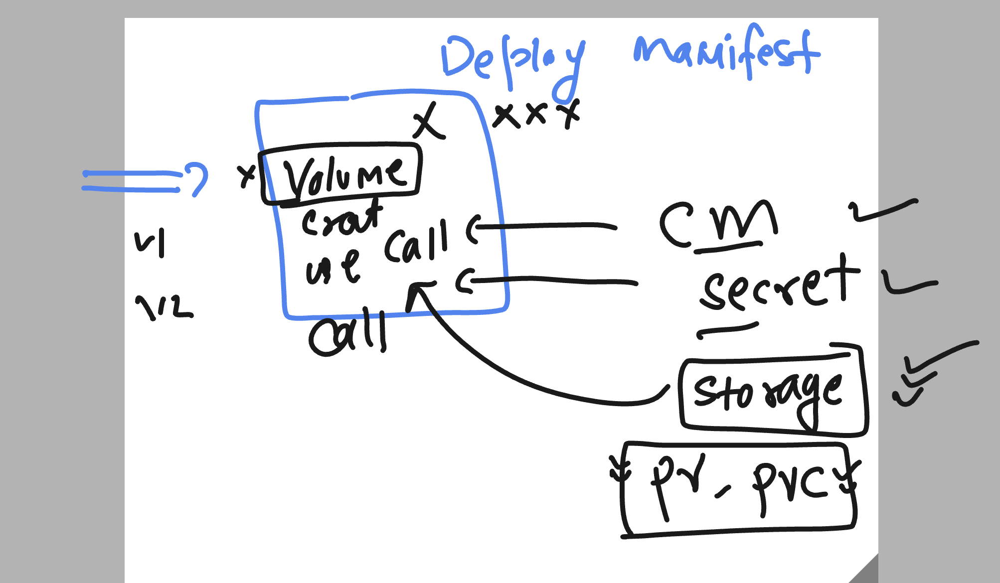
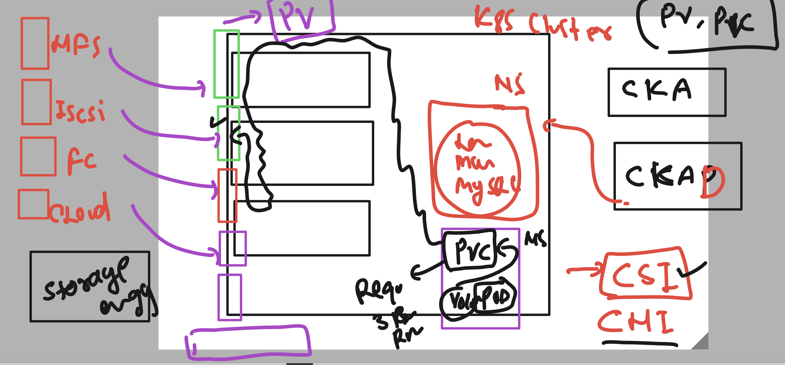

# k8s-cloud4c-b3

## Using Pv & PVC 



### Pv and PVC 



### cleaning up namespace 

```
[ashu@ip-172-31-5-47 ashu-docker-images]$ kubectl config get-contexts 
CURRENT   NAME                          CLUSTER      AUTHINFO           NAMESPACE
*         kubernetes-admin@kubernetes   kubernetes   kubernetes-admin   ashu-apps
[ashu@ip-172-31-5-47 ashu-docker-images]$ ls
components.yaml    day13-ingress-test  hpa-demo     java-app       labs_done.txt  node-app    webui-app
day11-two-tierapp  day16               ingress-win  k8s-manifests  new-webapp     python-app
[ashu@ip-172-31-5-47 ashu-docker-images]$ ls day16/
cm.yaml  db-cred.env  db-details.env  deploy.yaml  secret.yaml  svc.yaml  websvc.yaml  web.yaml
[ashu@ip-172-31-5-47 ashu-docker-images]$ 
[ashu@ip-172-31-5-47 ashu-docker-images]$ 
[ashu@ip-172-31-5-47 ashu-docker-images]$ kubectl  delete -f day16 
configmap "ashu-db-cm" deleted
deployment.apps "ashu-mysql" deleted
secret "ashu-db-cred" deleted
service "dblb1" deleted
deployment.apps "ashu-app" deleted
service "ashu-lb1" deleted
[ashu@ip-172-31-5-47 ashu-docker-images]$ kubectl  get all
No resources found in ashu-apps namespace.
[ashu@ip-172-31-5-47 ashu-docker-images]$ 
```


### Creating pv 

```
apiVersion: v1
kind: PersistentVolume
metadata:
  name: ashu-pv
spec:
  storageClassName: manual
  capacity:
    storage: 10Gi # from external source i am requesting 3Gi-10Gi 
  accessModes:
    - ReadWriteOnce
  nfs:
    path: "/data/db/ashu/"
    server: 172.31.5.47

```

### create request 

```
ashu@ip-172-31-5-47 day17]$ kubectl  create -f pv.yaml 
persistentvolume/ashu-pv created
[ashu@ip-172-31-5-47 day17]$ kubectl  get  pv
NAME         CAPACITY   ACCESS MODES   RECLAIM POLICY   STATUS      CLAIM                     STORAGECLASS   REASON   AGE
ankita-pv    4Gi        RWO            Retain           Available                             manual                  4s
ashu-pv      10Gi       RWO            Retain           Available                             manual                  8s
```

### creating PVC

```
apiVersion: v1
kind: PersistentVolumeClaim
metadata:
  name: ashu-db-claim
spec:
  storageClassName: manual
  accessModes:
    - ReadWriteMany
  resources:
    requests:
      storage: 3Gi # need of storage for my app 

```

===>

```
ashu@ip-172-31-5-47 day17]$ kubectl apply -f pvc.yaml
[ashu@ip-172-31-5-47 day17]$ kubectl  get  pvc
NAME            STATUS   VOLUME     CAPACITY   ACCESS MODES   STORAGECLASS   AGE
ashu-db-claim   Bound    vital-pv   3Gi        RWX            manual         58s
```
