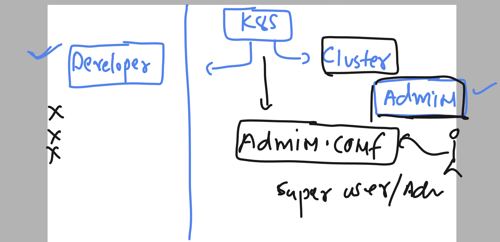
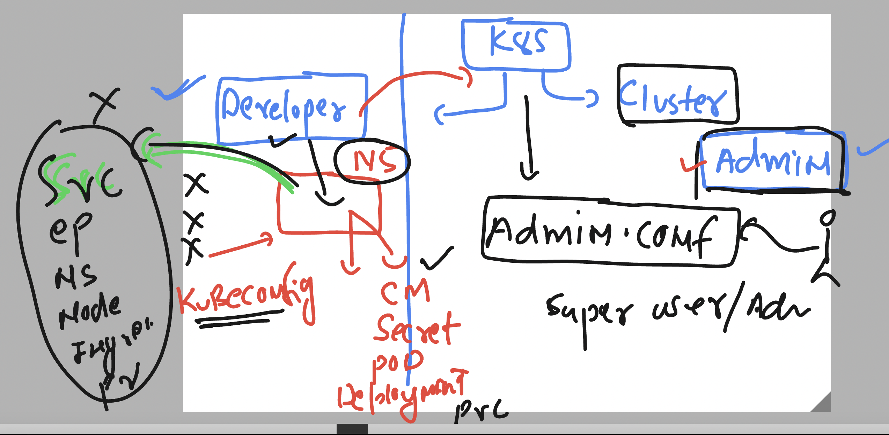
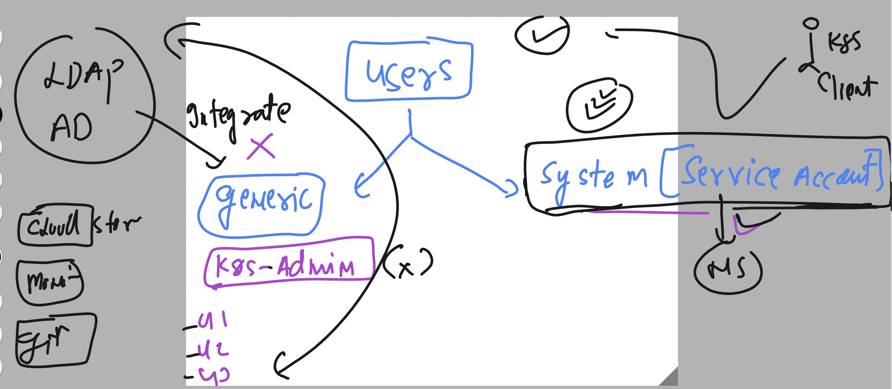
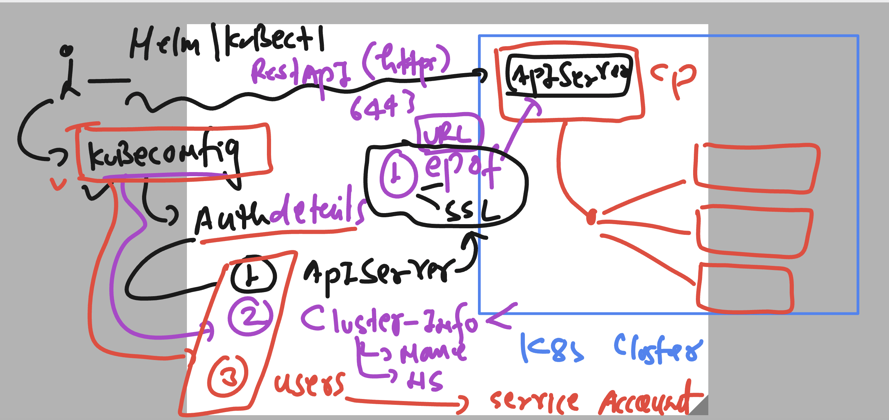
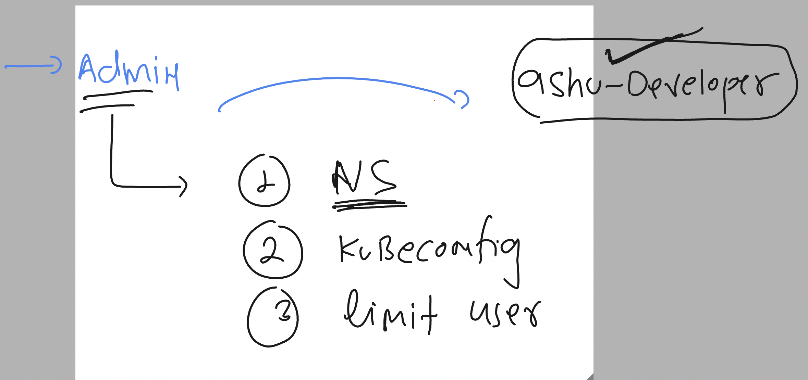
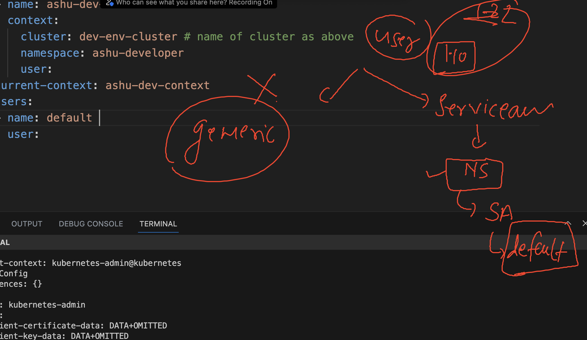

# k8s-cloud4c-b3

### k8s admin role 



### Developer roles 



### users in k8s 



### kubeconfig file in details



### checking cluster config file

```
[ashu@ip-172-31-5-47 ashu-docker-images]$ kubectl config  view 
apiVersion: v1
clusters:
- cluster:
    certificate-authority-data: DATA+OMITTED
    server: https://13.200.76.193:6443
  name: kubernetes
contexts:
- context:
    cluster: kubernetes
    namespace: ashu-apps
    user: kubernetes-admin
  name: kubernetes-admin@kubernetes
current-context: kubernetes-admin@kubernetes
kind: Config
preferences: {}
users:
- name: kubernetes-admin
  user:
    client-certificate-data: DATA+OMITTED
    client-key-data: DATA+OMITTED
```

### creating custom config for a particular developer 



```
kubectl  create  ns  ashu-developer 
```

### serviceaccount in namespace



### checking SA 

```
[ashu@ip-172-31-5-47 day18-labs]$ kubectl config get-contexts 
CURRENT   NAME                          CLUSTER      AUTHINFO           NAMESPACE
*         kubernetes-admin@kubernetes   kubernetes   kubernetes-admin   ashu-apps
[ashu@ip-172-31-5-47 day18-labs]$ 
[ashu@ip-172-31-5-47 day18-labs]$ kubectl  get serviceaccounts 
NAME      SECRETS   AGE
default   0         18d
[ashu@ip-172-31-5-47 day18-labs]$ 
[ashu@ip-172-31-5-47 day18-labs]$ 
[ashu@ip-172-31-5-47 day18-labs]$ kubectl  get serviceaccounts  -n ashu-developer 
NAME      SECRETS   AGE
default   0         14m
[ashu@ip-172-31-5-47 day18-labs]$ 
```

### creating service account 

```
[ashu@ip-172-31-5-47 day18-labs]$ kubectl create serviceaccount  only-testing -n ashu-developer 
serviceaccount/only-testing created
[ashu@ip-172-31-5-47 day18-labs]$ 
[ashu@ip-172-31-5-47 day18-labs]$ kubectl  get sa  -n ashu-developer 
NAME           SECRETS   AGE
default        0         16m
only-testing   0         3s
```

### creating token for service account 

```
apiVersion: v1
kind: Secret
metadata:
  name: sa-only-pass
  namespace: ashu-developer # Change this to your desired namespace
  annotations:
    kubernetes.io/service-account.name: only-testing
type: kubernetes.io/service-account-token
```

### 

```
 kubectl  apply -f token.yaml 
```

### getting token 

```
[ashu@ip-172-31-5-47 day18-labs]$ kubectl  describe  secret  sa-only-pass   -n ashu-developer 
Name:         sa-only-pass
Namespace:    ashu-developer
Labels:       <none>
Annotations:  kubernetes.io/service-account.name: only-testing
              kubernetes.io/service-account.uid: a9d945a5-fa5a-4708-a3f4-caab4f663387

Type:  kubernetes.io/service-account-token

Data
====
namespace:  14 bytes
token:      eyJhbGciOiJSUzI1NiIsImtpZCI6InlYNW5VdTJrc0JESW1pUk9KUnhYUVdtTnNwNXhwQkNFZVl0ZDh4SS16TW8ifQ.eyJpc3MiOiJrdWJlcm5ldGVzL3NlcnZpY2VhY2NvdW50Iiwia3ViZXJuZXRlcy5pby9zZXJ2aWNlYWNjb3VudC9uYW1lc3BhY2UiOiJhc2h1LWRldmVsb3BlciIsImt1YmVybmV0ZXMuaW8vc2VydmljZWFjY291bnQvc2Vjc
```
