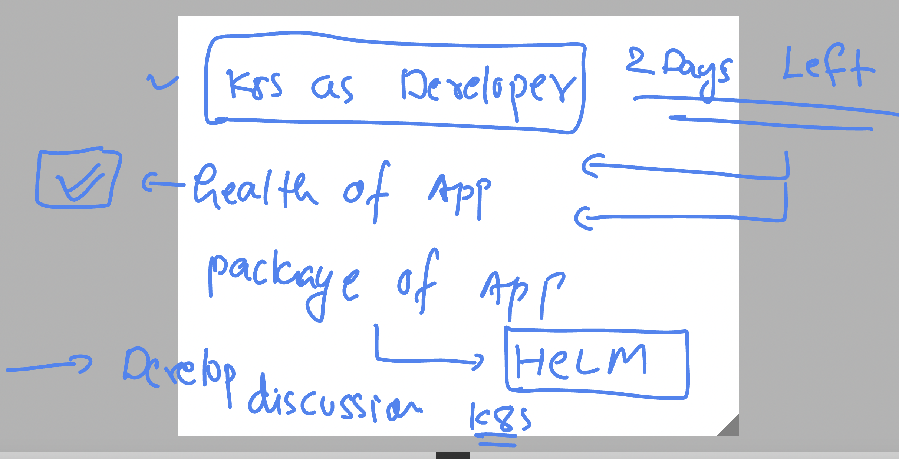
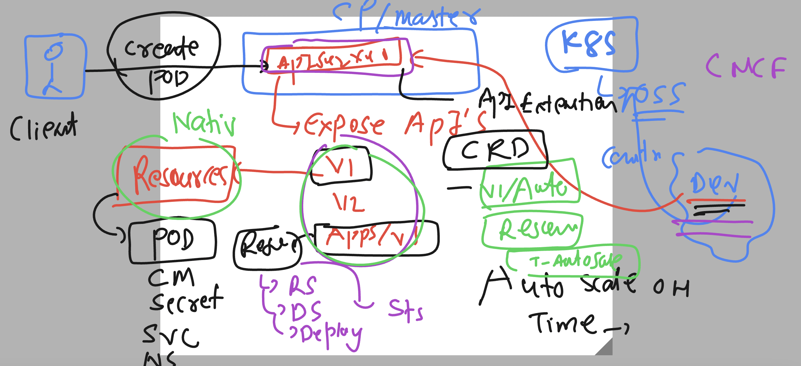
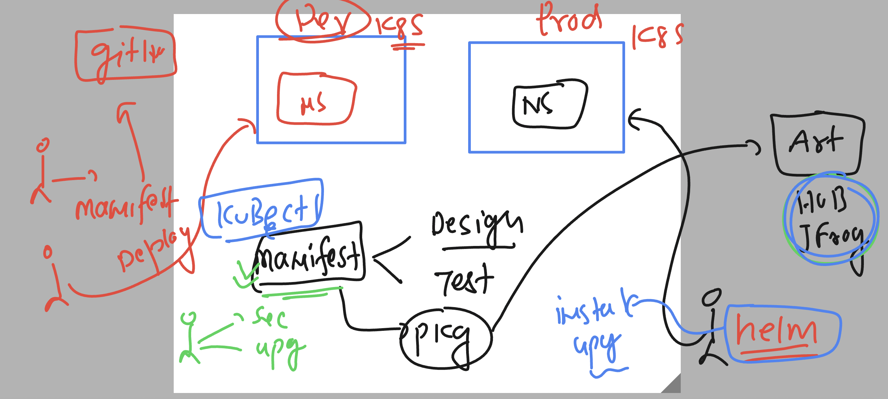
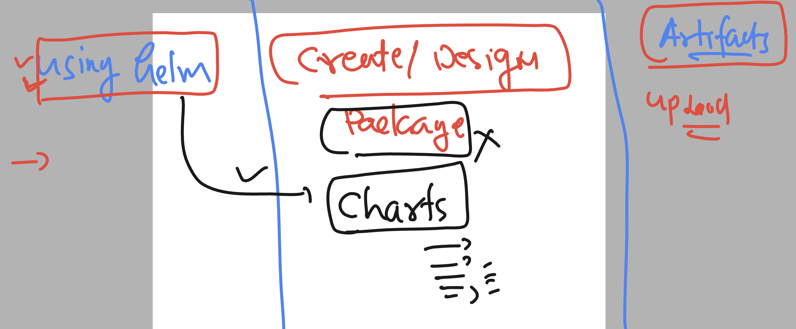

# k8s-cloud4c-b3

### targets



### Understanding CRD in k8s



### Quick revision of HeLM 



### Helm charts 



### revision of basics

```
 1009  helm  search repo   nginx 
 1010  helm install  ashu-webapp  ashu-repo2/nginx 
 1011  history 
[ashu@ip-172-31-5-47 ashu-docker-images]$ helm ls
NAME            NAMESPACE       REVISION        UPDATED                                 STATUS          CHART           APP VERSION
ashu-webapp     ashu-apps       1               2023-08-10 04:20:32.585060314 +0000 UTC deployed        nginx-15.1.2    1.25.1     
[ashu@ip-172-31-5-47 ashu-docker-images]$ 
[ashu@ip-172-31-5-47 ashu-docker-images]$ 
[ashu@ip-172-31-5-47 ashu-docker-images]$ kubectl  get  deploy
NAME                READY   UP-TO-DATE   AVAILABLE   AGE
ashu-webapp-nginx   1/1     1            1           17s
[ashu@ip-172-31-5-47 ashu-docker-images]$ kubectl  get  svc
NAME                TYPE           CLUSTER-IP       EXTERNAL-IP   PORT(S)        AGE
ashu-webapp-nginx   LoadBalancer   10.101.188.161   <pending>     80:30057/TCP   20s
[ashu@ip-172-31-5-47 ashu-docker-images]$ kubectl  get  po
NAME                                 READY   STATUS    RESTARTS   AGE
ashu-webapp-nginx-689f5c8fc7-ttbx2   1/1     Running   0          23s

====>

ashu@ip-172-31-5-47 ashu-docker-images]$ helm ls
NAME            NAMESPACE       REVISION        UPDATED                                 STATUS          CHART           APP VERSION
ashu-webapp     ashu-apps       1               2023-08-10 04:20:32.585060314 +0000 UTC deployed        nginx-15.1.2    1.25.1     
[ashu@ip-172-31-5-47 ashu-docker-images]$ helm uninstall ashu-webapp
release "ashu-webapp" uninstalled
[ashu@ip-172-31-5-47 ashu-docker-images]$ 
[ashu@ip-172-31-5-47 ashu-docker-images]$ 
[ashu@ip-172-31-5-47 ashu-docker-images]$ helm ls
NAME    NAMESPACE       REVISION        UPDATED STATUS  CHART   APP VERSION
[ashu@ip-172-31-5-47 ashu-docker-images]$ 
[ashu@ip-172-31-5-47 ashu-docker-images]$ kubectl  get all
No resources found in ashu-apps namespace.
[ashu@ip-172-31-5-47 ashu-docker-images]$ 


```

### Understanding helm charts

### pulling existing chart

```
[ashu@ip-172-31-5-47 helm-project]$ helm pull ashu-repo2/nginx 
[ashu@ip-172-31-5-47 helm-project]$ ls
nginx-15.1.2.tgz
[ashu@ip-172-31-5-47 h
```

### Decompression of charts package

```
[ashu@ip-172-31-5-47 helm-project]$ ls
nginx-15.1.2.tgz
[ashu@ip-172-31-5-47 helm-project]$ tar xvzf nginx-15.1.2.tgz 
nginx/Chart.yaml
nginx/Chart.lock
nginx/values.yaml
nginx/values.schema.json
nginx/templates/NOTES.txt
nginx/templates/_helpers.tpl
```

### charts is just a organized directory 

```
[ashu@ip-172-31-5-47 helm-project]$ cd  nginx/
[ashu@ip-172-31-5-47 nginx]$ ls
Chart.lock  charts  Chart.yaml  README.md  templates  values.schema.json  values.yaml
[ashu@ip-172-31-5-47 nginx]$ 


```

### using custom values.yaml file to update the existing charts values while install

```
ashu@ip-172-31-5-47 helm-project]$ helm install ashu-app ashu-repo2/nginx    --values  values.yaml 
NAME: ashu-app
LAST DEPLOYED: Thu Aug 10 04:43:31 2023
NAMESPACE: ashu-apps
STATUS: deployed
REVISION: 1
TEST SUITE: None

====>

```

## Creating helm charts 

### 

```
ashu@ip-172-31-5-47 helm-project]$ ls
nginx  values.yaml
[ashu@ip-172-31-5-47 helm-project]$ 
[ashu@ip-172-31-5-47 helm-project]$ helm  create  ashu-react-app
Creating ashu-react-app
[ashu@ip-172-31-5-47 helm-project]$ ls
ashu-react-app  nginx  values.yaml
[ashu@ip-172-31-5-47 helm-project]$ 
[ashu@ip-172-31-5-47 helm-project]$ 
[ashu@ip-172-31-5-47 helm-project]$ cd  ashu-react-app/
[ashu@ip-172-31-5-47 ashu-react-app]$ ls
charts  Chart.yaml  templates  values.yaml
[ashu@ip-172-31-5-47 ashu-react-app]$ ls  templates/
deployment.yaml  _helpers.tpl  hpa.yaml  ingress.yaml  NOTES.txt  serviceaccount.yaml  service.yaml  tests
[ashu@ip-172-31-5-47 ashu-react-app]$ 
```

### udpating values.yaml

```
# Default values for ashu-react-app.
# This is a YAML-formatted file.
# Declare variables to be passed into your templates.

replicaCount: 1

image:
  repository: dockerashu/reactapp
  pullPolicy: IfNotPresent
  # Overrides the image tag whose default is the chart appVersion.
  tag: version1

imagePullSecrets: []
nameOverride: ""
fullnameOverride: ""

serviceAccount:
  # Specifies whether a service account should be created
  create: true
  # Annotations to add to the service account
  annotations: {}
  # The name of the service account to use.
  # If not set and create is true, a name is generated using the fullname template
  name: ""

podAnnotations: {}

podSecurityContext: {}
  # fsGroup: 2000

securityContext: {}
  # capabilities:
  #   drop:
  #   - ALL
  # readOnlyRootFilesystem: true
  # runAsNonRoot: true
  # runAsUser: 1000

service:
  type: NodePort
  port: 3000

ingress:
  enabled: false
  className: ""
  annotations: {}
    # kubernetes.io/ingress.class: nginx
    # kubernetes.io/tls-acme: "true"
  hosts:
    - host: chart-example.local
      paths:
        - path: /
          pathType: ImplementationSpecific
  tls: []
  #  - secretName: chart-example-tls
  #    hosts:
  #      - chart-example.local

resources: {}
  # We usually recommend not to specify default resources and to leave this as a conscious
  # choice for the user. This also increases chances charts run on environments with little
  # resources, such as Minikube. If you do want to specify resources, uncomment the following
  # lines, adjust them as necessary, and remove the curly braces after 'resources:'.
  # limits:
  #   cpu: 100m
  #   memory: 128Mi
  # requests:
  #   cpu: 100m
  #   memory: 128Mi

autoscaling:
  enabled: false
  minReplicas: 1
  maxReplicas: 100
  targetCPUUtilizationPercentage: 80
  # targetMemoryUtilizationPercentage: 80

nodeSelector: {}

tolerations: []

affinity: {}

```


