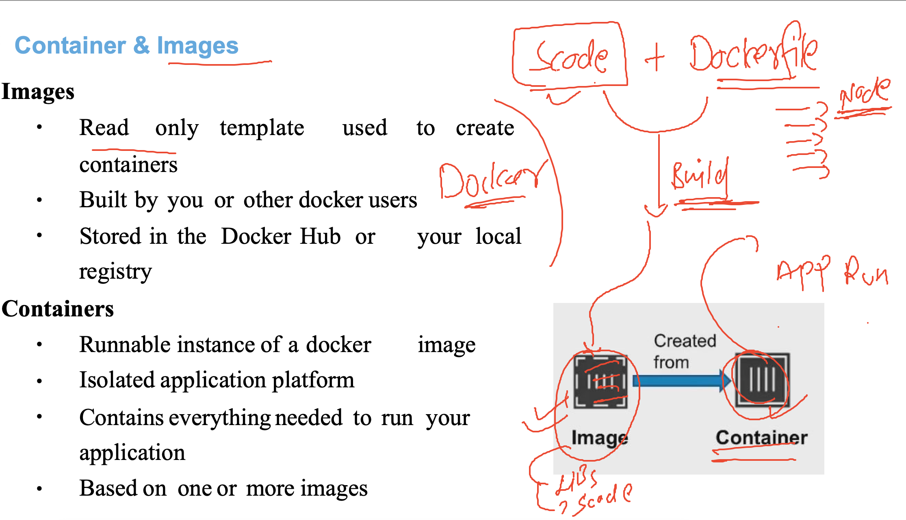

# k8s-cloud4c-b3

### understanding app containerization process



### creating directory structure to store the source code

```
ashu@ip-172-31-5-47 ~]$ whoami
ashu
[ashu@ip-172-31-5-47 ~]$ ls
[ashu@ip-172-31-5-47 ~]$ mkdir  ashu-docker-images
[ashu@ip-172-31-5-47 ~]$ 
[ashu@ip-172-31-5-47 ~]$ mkdir  ashu-docker-images/node-app
[ashu@ip-172-31-5-47 ~]$ mkdir  ashu-docker-images/java-app
[ashu@ip-172-31-5-47 ~]$ mkdir  ashu-docker-images/python-app
[ashu@ip-172-31-5-47 ~]$ mkdir  ashu-docker-images/webui-app
[ashu@ip-172-31-5-47 ~]$ ls
ashu-docker-images
[ashu@ip-172-31-5-47 ~]$ ls ashu-docker-images/
java-app  node-app  python-app  webui-app
[ashu@ip-172-31-5-47 ~]$ 
```

### taking some sample webui code to convert / build into docker image

```
[ashu@ip-172-31-5-47 ashu-docker-images]$ ls
java-app  node-app  python-app  webui-app
[ashu@ip-172-31-5-47 ashu-docker-images]$ cd  webui-app/
[ashu@ip-172-31-5-47 webui-app]$ ls
[ashu@ip-172-31-5-47 webui-app]$ git clone https://github.com/schoolofdevops/html-sample-app.git
Cloning into 'html-sample-app'...
remote: Enumerating objects: 74, done.
remote: Counting objects: 100% (74/74), done.
remote: Compressing objects: 100% (69/69), done.
remote: Total 74 (delta 5), reused 72 (delta 5), pack-reused 0
Receiving objects: 100% (74/74), 1.38 MiB | 19.37 MiB/s, done.
Resolving deltas: 100% (5/5), done.
[ashu@ip-172-31-5-47 webui-app]$ ls
html-sample-app
[ashu@ip-172-31-5-47 webui-app]$ ls html-sample-app/
assets  elements.html  generic.html  html5up-phantom.zip  images  index.html  LICENSE.txt  README.txt
[ashu@ip-172-31-5-47 webui-app]$ 
```

### creating Dockerfile for html code base

## Dockerfile

```
FROM nginx
# this mean we are refering nginx lib from Docker hub
LABEL name=ashutoshh
LABEL email=ashutoshh@linux.com
# optional info but good to write if someone need to contact
COPY html-sample-app /usr/share/nginx/html/
# we are coping html-code to the location of nginx 
# from where nginx can read by default 

```

### lets build image of webui app using docker build

```
[ashu@ip-172-31-5-47 webui-app]$ ls
Dockerfile  html-sample-app
[ashu@ip-172-31-5-47 webui-app]$ docker build -t ashu-ui:v1 . 
Sending build context to Docker daemon  3.629MB
Step 1/4 : FROM nginx
latest: Pulling from library/nginx
faef57eae888: Pull complete 
76579e9ed380: Pull complete 
cf707e233955: Pull complete 
91bb7937700d: Pull complete 
4b962717ba55: Pull complete 
f46d7b05649a: Pull complete 
103501419a0a: Pull complete 
Digest: sha256:08bc36ad52474e528cc1ea3426b5e3f4bad8a130318e3140d6cfe29c8892c7ef
Status: Image is up to date for nginx:latest
 ---> 021283c8eb95
Step 2/4 : LABEL name=ashutoshh
 ---> Running in 7ae5df958edb
Removing intermediate container 7ae5df958edb
 ---> d6bf21fa45a3
Step 3/4 : LABEL email=ashutoshh@linux.com
 ---> Running in 5a23ea2c00a7
Removing intermediate container 5a23ea2c00a7
 ---> 43cc818e30ac
Step 4/4 : COPY html-sample-app /usr/share/nginx/html/
 ---> 30bb75b24fc6
Successfully built 30bb75b24fc6
Successfully tagged ashu-ui:v1
```

### verify build 

```
[ashu@ip-172-31-5-47 webui-app]$ docker images
REPOSITORY   TAG       IMAGE ID       CREATED              SIZE
nikita-ui    v1        6c0c0f181589   37 seconds ago       190MB
ashu-ui      v1        30bb75b24fc6   About a minute ago   190MB
ankita-ui    v1        b69e948143eb   About a minute ago   190MB
vital-ui     v1        bdf3530b9f02   About a minute ago   190MB
nginx        latest    021283c8eb95   13 days ago          187MB
```
