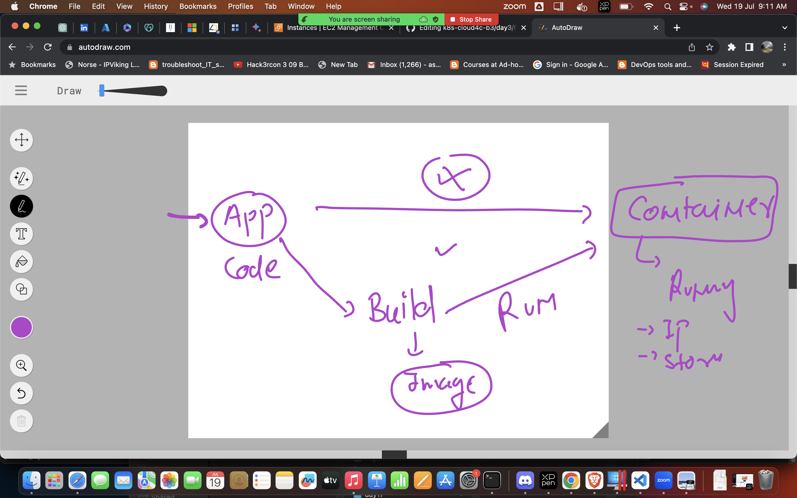
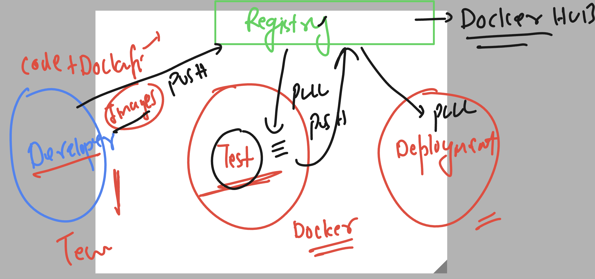

# k8s-cloud4c-b3
## Revision 



## Nodejs app to container image

### cloning app source code

```
[ashu@ip-172-31-5-47 ashu-docker-images]$ ls
java-app  node-app  python-app  webui-app

[ashu@ip-172-31-5-47 ashu-docker-images]$ cd node-app/
[ashu@ip-172-31-5-47 node-app]$ ls
[ashu@ip-172-31-5-47 node-app]$ git clone https://github.com/redashu/node-demo-app-spinnaker.git
Cloning into 'node-demo-app-spinnaker'...
remote: Enumerating objects: 71, done.
remote: Counting objects: 100% (2/2), done.
remote: Compressing objects: 100% (2/2), done.
remote: Total 71 (delta 0), reused 0 (delta 0), pack-reused 69
Receiving objects: 100% (71/71), 15.73 KiB | 5.24 MiB/s, done.
Resolving deltas: 100% (29/29), done.

[ashu@ip-172-31-5-47 node-app]$ ls
node-demo-app-spinnaker


[ashu@ip-172-31-5-47 node-app]$ ls node-demo-app-spinnaker/
backup.dockerfile  demo-app.yml         index.js  Makefile      package-lock.json
debian             Dockerfile.builddep  init      package.json  README.md
[ashu@ip-172-31-5-47 node-app]$ 
```

### Add Dockerfile into source code 

### Dockerfile

```
FROM node
LABEL email=ashutoshh@delvex.io
RUN mkdir /myapp
COPY node-demo-app-spinnaker /myapp/
WORKDIR /myapp
# to change folder location 
RUN npm install 
CMD ["npm","start"]
# use of CMD is to run this while creating container
```

### .dockerignore

```
node-demo-app-spinnaker/README.md
node-demo-app-spinnaker/.git
node-demo-app-spinnaker/backup.dockerfile

```

### time to build it

```
[ashu@ip-172-31-5-47 node-app]$ docker build -t ashunode:appv1  . 
Sending build context to Docker daemon  31.74kB
Step 1/7 : FROM node
latest: Pulling from library/node
d52e4f012db1: Already exists 
7dd206bea61f: Already exists 
2320f9be4a9c: Already exists 
6e5565e0ba8d: Already exists 
5f1526a28cf9: Pull complete 
b9c7405b482f: Pull complete 
9db0bc99587b: Pull complete 
8e1c8c1907a5: Pull complete 
Digest: sha256:b3ca7d32f0c12291df6e45a914d4ee60011a3fce4a978df5e609e356a4a2cb88
Status: Downloaded newer image for node:latest
 ---> b098c9ebef91
Step 2/7 : LABEL email=ashutoshh@delvex.io
 ---> Running in dc2ba73f2af4
Removing intermediate container dc2ba73f2af4
 ---> 6a42e723d5eb
Step 3/7 : RUN mkdir /myapp
 ---> Running in 4df1a4681f31
Removing intermediate container 4df1a4681f31
 ---> 1d51a7908ea3
Step 4/7 : COPY node-demo-app-spinnaker /myapp/
 ---> 5c432a25ae59
Step 5/7 : WORKDIR /myapp
 ---> Running in ba96f273ac65
Removing intermediate container ba96f273ac65
 ---> a34bbca6e9ea
Step 6/7 : RUN npm install
 ---> Running in 3f7cda444780
npm WARN old lockfile 
npm WARN old lockfile The package-lock.json file was created with an old version of npm,
npm WARN old lockfile so supplemental metadata must be fetched from the registry.
npm WARN old lockfile 
npm WARN old lockfile This is a one-time fix-up, please be patient...
npm WARN old lockfile 

added 49 packages, and audited 50 packages in 2s

3 high severity vulnerabilities

To address all issues, run:
  npm audit fix

Run `npm audit` for details.
npm notice 
npm notice New minor version of npm available! 9.7.2 -> 9.8.0
npm notice Changelog: <https://github.com/npm/cli/releases/tag/v9.8.0>
npm notice Run `npm install -g npm@9.8.0` to update!
npm notice 
Removing intermediate container 3f7cda444780
 ---> 2b64eddce042
Step 7/7 : CMD ["npm","start"]
 ---> Running in 116025dd409a
Removing intermediate container 116025dd409a
 ---> d81cf98fe574
Successfully built d81cf98fe574
Successfully tagged ashunode:appv1
```

### verify image 

```
ashu@ip-172-31-5-47 node-app]$ docker images 
REPOSITORY                TAG       IMAGE ID       CREATED              SIZE
ankitanode                v1        872d13c0d981   56 seconds ago       1.1GB
ashunode                  appv1     d81cf98fe574   About a minute ago   1.1GB
```
### creating another dockerfile 

```
FROM node:alpine
LABEL email=ashutoshh@delvex.io
RUN mkdir /myapp
COPY node-demo-app-spinnaker /myapp/
WORKDIR /myapp
# to change folder location 
RUN npm install 
CMD ["npm","start"]
# use of CMD is to run this while creating container
```

### running it

```
[ashu@ip-172-31-5-47 node-app]$ ls
Dockerfile  node-demo-app-spinnaker  trynew.dockerfile
[ashu@ip-172-31-5-47 node-app]$ docker build -t  ashunode:appv3 -f trynew.dockerfile  . 
Sending build context to Docker daemon  32.77kB
Step 1/7 : FROM node:alpine
 ---> 49ee0e374837
Step 2/7 : LABEL email=ashutoshh@delvex.io
 ---> Running in 07a34f046018
Removing intermediate container 07a34f046018
 ---> baf1b6bd68e3
Step 3/7 : RUN mkdir /myapp
 ---> Running in 9b38f87af84d
Removing intermediate container 9b38f87af84d
 ---> 58407f50f5e0
Step 4/7 : COPY node-demo-app-spinnaker /myapp/
 ---> 547dd30177a2
Step 5/7 : WORKDIR /myapp
 ---> Running in 04443e6a13e9
Removing intermediate container 04443e6a13e9
 ---> 7b808cf76b47
Step 6/7 : RUN npm install
 ---> Running in c4cb9fbf8185
npm WARN old lockfile 
npm WARN old lockfile The package-lock.json file was created with an old version of npm,
npm WARN old lockfile so supplemental metadata must be fetched from the registry.
npm WARN old lockfile 
npm WARN old lockfile This is a one-time fix-up, please be patient...
npm WARN old lockfile 

added 49 packages, and audited 50 packages in 2s

3 high severity vulnerabilities

To address all issues, run:
  npm audit fix

Run `npm audit` for details.
npm notice 
npm notice New minor version of npm available! 9.7.2 -> 9.8.0
npm notice Changelog: <https://github.com/npm/cli/releases/tag/v9.8.0>
npm notice Run `npm install -g npm@9.8.0` to update!
npm notice 
Removing intermediate container c4cb9fbf8185
 ---> b1ba1bded42e
Step 7/7 : CMD ["npm","start"]
 ---> Running in a63b8a53b6c8
Removing intermediate container a63b8a53b6c8
 ---> 4feade147a07
Successfully built 4feade147a07
Successfully tagged ashunode:appv3
```

### creating container

```
 docker run --name ashuc1 -d -p  1234:3000  ashunode:appv1 
```
## removing container 

```
[ashu@ip-172-31-5-47 ashu-docker-images]$ docker stop ashuc1
ashuc1
[ashu@ip-172-31-5-47 ashu-docker-images]$ docker rm ashuc1
ashuc1
[ashu@ip-172-31-5-47 ashu-docker-images]$ 


```

## image sharing registry docker hub 




## pushing image to docker hub 

### step 1 -- convert image to the supported format of docker hub

```
[ashu@ip-172-31-5-47 ashu-docker-images]$ docker images | grep ashu
ashunode                  appv3     4feade147a07   36 minutes ago      186MB
ashunode                  appv1     6afdf9164438   44 minutes ago      1.1GB
ashunode                  appv2     d81cf98fe574   49 minutes ago      1.1GB
ashupy                    v11       da6173f10096   23 hours ago        997MB
ashu-ui                   v1        277fb6dca6b5   24 hours ago        190MB
[ashu@ip-172-31-5-47 ashu-docker-images]$ docker  tag ashunode:appv1   docker.io/dockerashu/ashunode:version1 
[ashu@ip-172-31-5-47 ashu-docker-images]$ 


```

### image format


### step 2 -- Login to docker hub from docker cli 

```
[ashu@ip-172-31-5-47 ashu-docker-images]$ docker login 
Login with your Docker ID to push and pull images from Docker Hub. If you don't have a Docker ID, head over to https://hub.docker.com to create one.
Username: dockerashu
Password: 
WARNING! Your password will be stored unencrypted in /home/ashu/.docker/config.json.
Configure a credential helper to remove this warning. See
https://docs.docker.com/engine/reference/commandline/login/#credentials-store

Login Succeeded
[ashu@ip-172-31-5-47 ashu-docker-images]$ 
```

### step 3 -- push and verify 

```
[ashu@ip-172-31-5-47 ashu-docker-images]$ docker push docker.io/dockerashu/ashunode:version1  
The push refers to repository [docker.io/dockerashu/ashunode]
c9350bdf6c0b: Pushed 
622381da4ae3: Pushed 
af7c9f18c3e3: Pushed 
89e26aac0240: Mounted from library/node 
af5005bda04e: Mounted from library/node 
```

### to pull image 

```
 docker pull dockerashu/ashunode:version1
 
version1: Pulling from dockerashu/ashunode
d52e4f012db1: Downloading [=======================>                           ]  23.36MB/49.55MB
7dd206bea61f: Download complete 
2320f9be4a9c: Download complete 
6e5565e0ba8d: Downloading [=========>                                         ]  41.91MB/211MB
5f1526a28cf9: Download complete 
```

