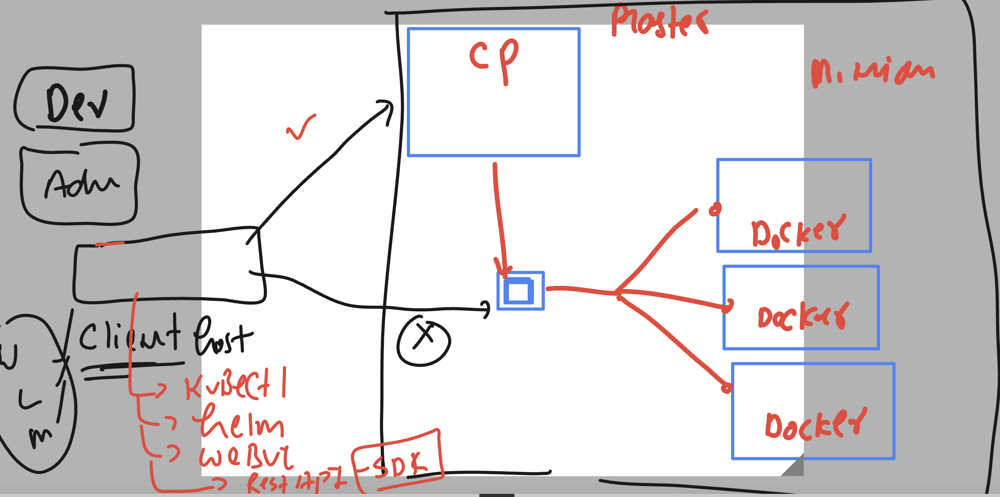
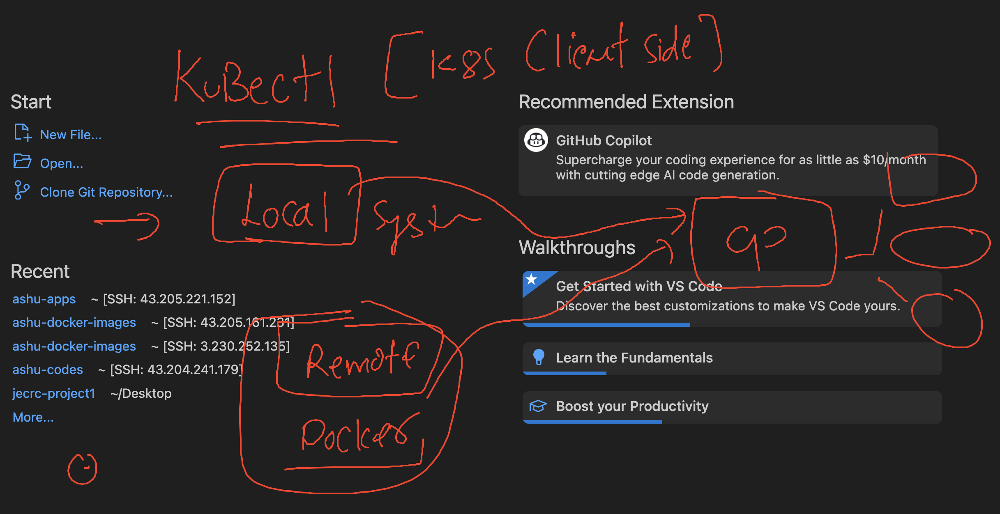
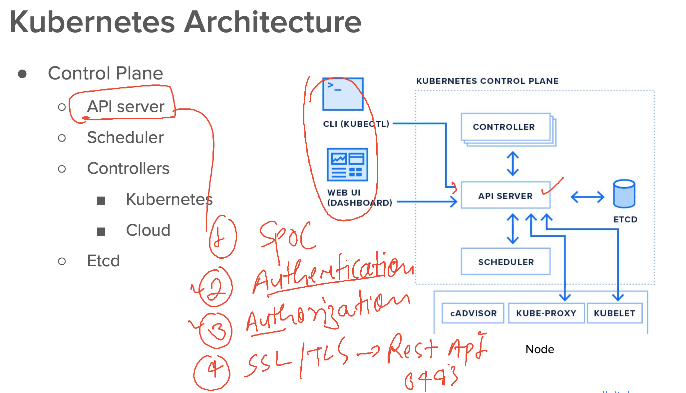
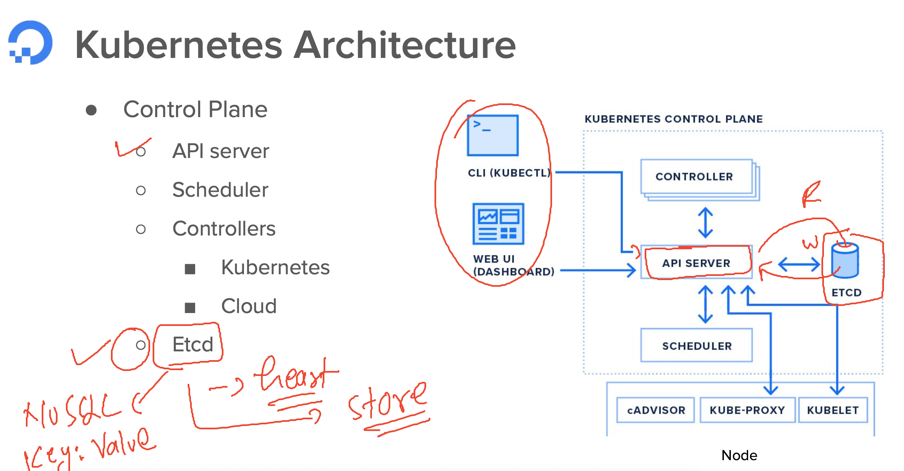
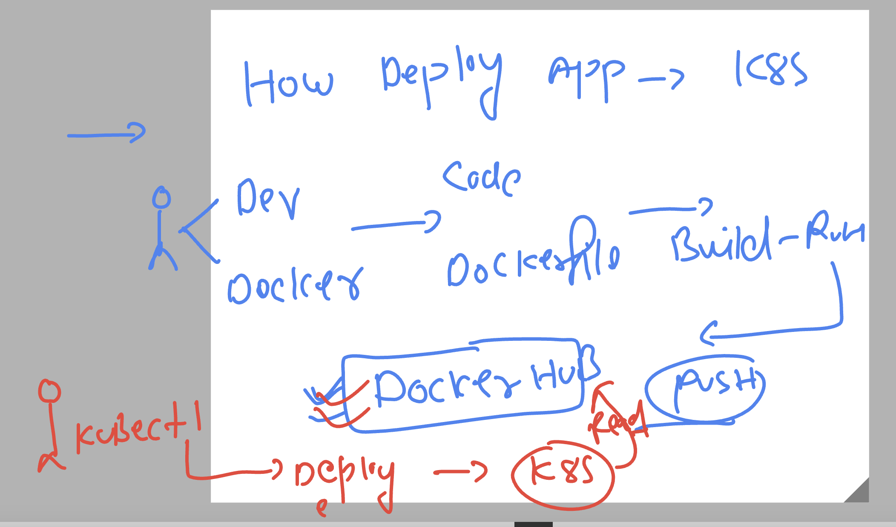
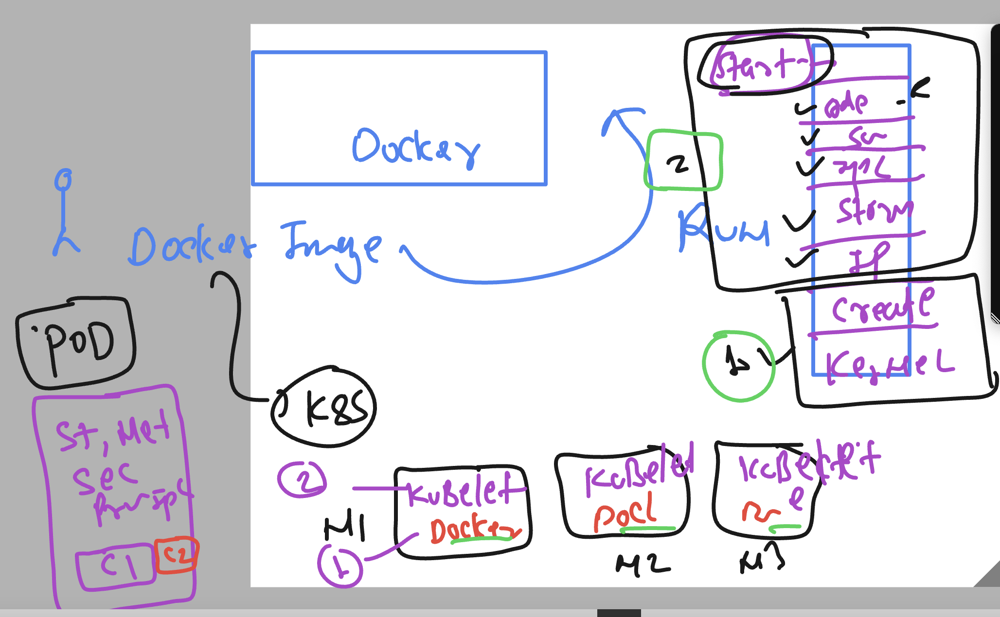
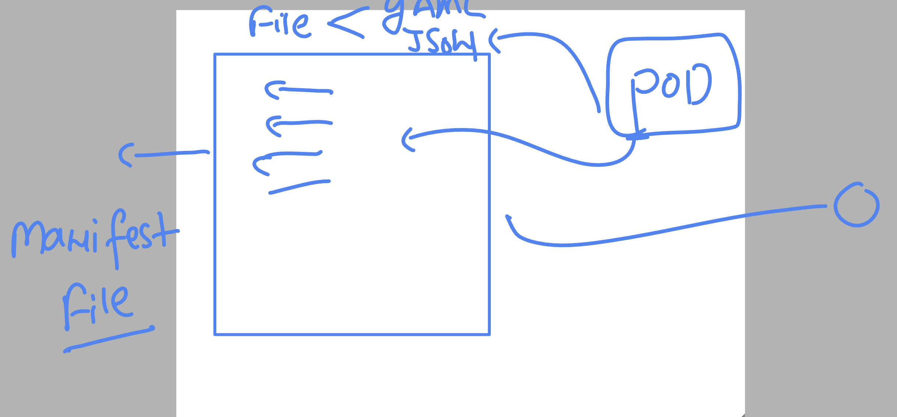
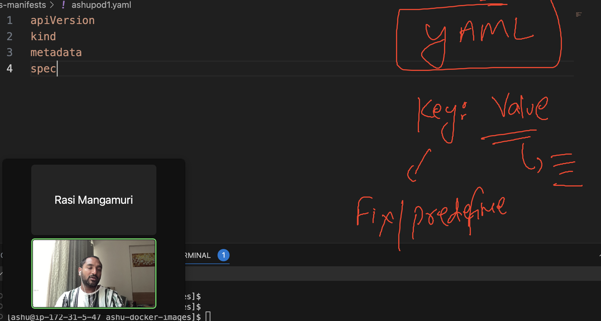

# k8s-cloud4c-b3

### k8s client and control plane relation 



### local and remote client possiblity 



### Kubectl download in windows system as kubernetes client tool 

[click_here](https://kubernetes.io/docs/tasks/tools/)

### verify it 

```
                                                                PS C:\Users\humanfirmware> cd .\Downloads\
PS C:\Users\humanfirmware\Downloads> .\kubectl.exe  version --client
WARNING: This version information is deprecated and will be replaced with the output from kubectl version --short.  Use --output=yaml|json to get the full version.
Client Version: version.Info{Major:"1", Minor:"27", GitVersion:"v1.27.3", GitCommit:"25b4e43193bcda6c7328a6d147b1fb73a33f1598", GitTreeState:"clean", BuildDate:"2023-06-14T09:53:42Z", GoVersion:"go1.20.5", Compiler:"gc", Platform:"windows/amd64"}
Kustomize Version: v5.0.1
PS C:\Users\humanfirmware\Downloads> .\kubectl.exe  version --client   -o yaml
clientVersion:
  buildDate: "2023-06-14T09:53:42Z"
  compiler: gc
  gitCommit: 25b4e43193bcda6c7328a6d147b1fb73a33f1598
  gitTreeState: clean
  gitVersion: v1.27.3
  goVersion: go1.20.5
  major: "1"
  minor: "27"
  platform: windows/amd64
kustomizeVersion: v5.0.1

PS C:\Users\humanfirmware\Downloads> .\kubectl.exe  version --client   -o json
{
  "clientVersion": {
    "major": "1",
    "minor": "27",
    "gitVersion": "v1.27.3",
    "gitCommit": "25b4e43193bcda6c7328a6d147b1fb73a33f1598",
    "gitTreeState": "clean",
    "buildDate": "2023-06-14T09:53:42Z",
    "goVersion": "go1.20.5",
    "compiler": "gc",
    "platform": "windows/amd64"
  },
  "kustomizeVersion": "v5.0.1"
}
```

### kubectl syntax is same from any OS 

```
[ashu@ip-172-31-5-47 ashu-docker-images]$ kubectl version --client  -o yaml
clientVersion:
  buildDate: "2023-06-14T09:53:42Z"
  compiler: gc
  gitCommit: 25b4e43193bcda6c7328a6d147b1fb73a33f1598
  gitTreeState: clean
  gitVersion: v1.27.3
  goVersion: go1.20.5
  major: "1"
  minor: "27"
  platform: linux/amd64
kustomizeVersion: v5.0.1

```

## Understanding k8s architecture components

# COntrol plane 

### api-server 



### location of api-server cred file on master node

```
[root@masternode ~]# cd  /etc/kubernetes/
[root@masternode kubernetes]# ls
admin.conf
```

### after downloading admin.conf to the client location lets verify connection 

```
[ashu@ip-172-31-5-47 ashu-docker-images]$ ls
admin.conf  java-app  node-app  python-app  webui-app
[ashu@ip-172-31-5-47 ashu-docker-images]$ 
[ashu@ip-172-31-5-47 ashu-docker-images]$ kubectl  cluster-info    --kubeconfig  admin.conf  
Kubernetes control plane is running at https://13.200.76.193:6443
CoreDNS is running at https://13.200.76.193:6443/api/v1/namespaces/kube-system/services/kube-dns:dns/proxy

To further debug and diagnose cluster problems, use 'kubectl cluster-info dump'.
[ashu@ip-172-31-5-47 ashu-docker-images]$ 

```

### checking node info using kubectl 

```
[ashu@ip-172-31-5-47 ashu-docker-images]$ kubectl  get nodes  --kubeconfig  admin.conf 
NAME         STATUS   ROLES           AGE   VERSION
masternode   Ready    control-plane   19h   v1.27.3
node1        Ready    <none>          19h   v1.27.3
node2        Ready    <none>          19h   v1.27.3
node3        Ready    <none>          19h   v1.27.3
[ashu@ip-172-31-5-47 ashu-docker-images]$ 
```

### lets copy admin.conf to its default location 

```
[ashu@ip-172-31-5-47 ashu-docker-images]$ whoami
ashu
[ashu@ip-172-31-5-47 ashu-docker-images]$ mkdir  ~/.kube 
mkdir: cannot create directory ‘/home/ashu/.kube’: File exists
[ashu@ip-172-31-5-47 ashu-docker-images]$ 
[ashu@ip-172-31-5-47 ashu-docker-images]$ cp  admin.conf   ~/.kube/config 
[ashu@ip-172-31-5-47 ashu-docker-images]$ 
[ashu@ip-172-31-5-47 ashu-docker-images]$ 
[ashu@ip-172-31-5-47 ashu-docker-images]$ kubectl  get nodes  
NAME         STATUS   ROLES           AGE   VERSION
masternode   Ready    control-plane   20h   v1.27.3
node1        Ready    <none>          20h   v1.27.3
node2        Ready    <none>          20h   v1.27.3
node3        Ready    <none>          20h   v1.27.3
```

## Etcd in master node



## to deploy any app -- it must be available to any Registry like docker hub 



### introduction to pod



### creating manifest file and sending it to the api-server 



### fixed manifest keywords



## Pod Manifest file 

```
apiVersion: v1 
kind: Pod 
metadata: # info about Kind (pod)
  name: ashu-node-pod1  # name of my pod  
spec:  # everything we need to create pod 
  containers: # planning containers here 
  - name: ashuc1 
    image: docker.io/dockerashu/ashunode:version1 # image from docker hub  
    ports: # container app port info -- optional these days 
    - containerPort: 3000 


```

### lets deploy it 

```
[ashu@ip-172-31-5-47 ashu-docker-images]$ ls
java-app  k8s-manifests  node-app  python-app  webui-app
[ashu@ip-172-31-5-47 ashu-docker-images]$ cd  k8s-manifests/
[ashu@ip-172-31-5-47 k8s-manifests]$ ls
ashupod1.yaml
[ashu@ip-172-31-5-47 k8s-manifests]$ kubectl  create  -f  ashupod1.yaml  
pod/ashu-node-pod1 created
[ashu@ip-172-31-5-47 k8s-manifests]$ kubectl   get  pods 
NAME             READY   STATUS    RESTARTS   AGE
ashu-node-pod1   1/1     Running   0          35s
[ashu@ip-172-31-5-47 k8s-manifests]$ 

```
