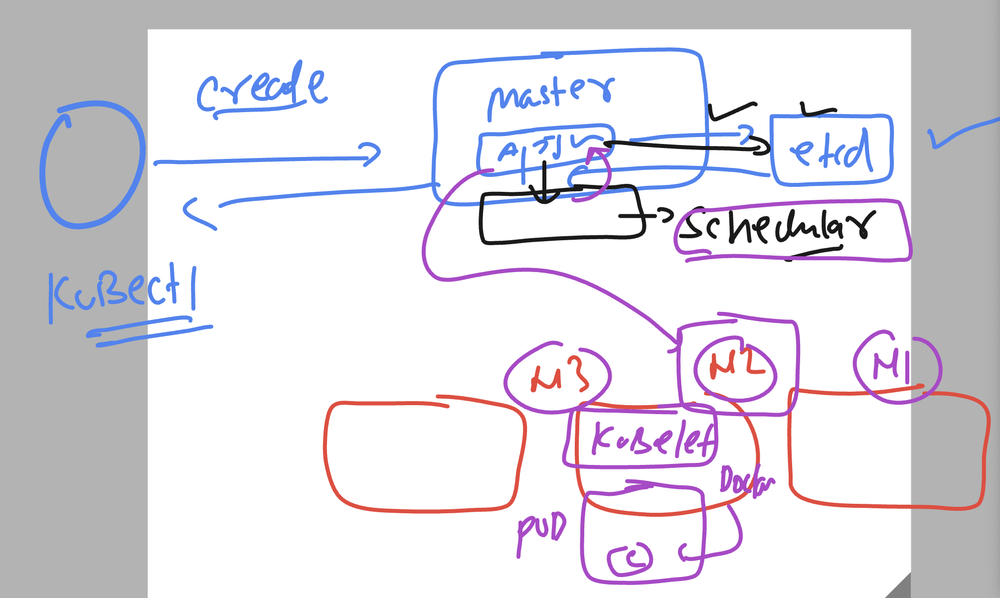
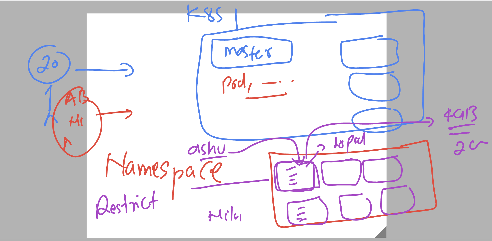
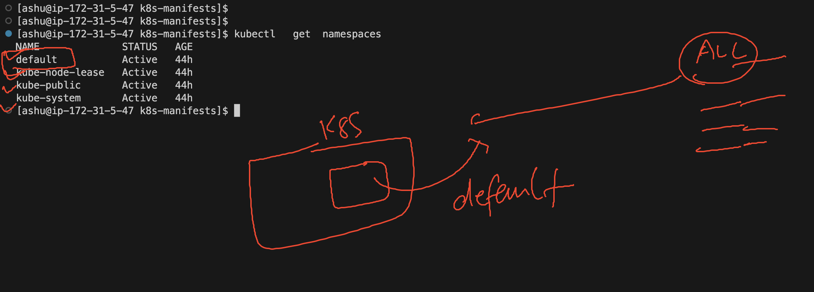

# k8s-cloud4c-b3

### Revision 


### Redeploy same pod manifest of last day 

```
[ashu@ip-172-31-5-47 ashu-docker-images]$ ls
java-app  k8s-manifests  labs.txt  node-app  python-app  webui-app
[ashu@ip-172-31-5-47 ashu-docker-images]$ cd  k8s-manifests/
[ashu@ip-172-31-5-47 k8s-manifests]$ ls
ashupod1.yaml
[ashu@ip-172-31-5-47 k8s-manifests]$ kubectl  create -f  ashupod1.yaml 
pod/ashu-node-pod1 created
[ashu@ip-172-31-5-47 k8s-manifests]$ kubectl  get  pods
NAME             READY   STATUS    RESTARTS   AGE
ashu-node-pod1   1/1     Running   0          7s
dasa-node-pod1   1/1     Running   0          4m5s
[ashu@ip-172-31-5-47 k8s-manifests]$ 
```

## master node -- schedular component 



### checking pod node status

```
[ashu@ip-172-31-5-47 k8s-manifests]$ kubectl   get  nodes
NAME         STATUS   ROLES           AGE   VERSION
masternode   Ready    control-plane   43h   v1.27.3
node1        Ready    <none>          43h   v1.27.3
node2        Ready    <none>          43h   v1.27.3
node3        Ready    <none>          43h   v1.27.3
[ashu@ip-172-31-5-47 k8s-manifests]$ kubectl  get  pods  ashu-node-pod1  -o wide
NAME             READY   STATUS    RESTARTS   AGE   IP               NODE    NOMINATED NODE   READINESS GATES
ashu-node-pod1   1/1     Running   0          18m   192.168.104.22   node2   <none>           <none>
[ashu@ip-172-31-5-47 k8s-manifests]$ 

```
### checking all the pods info 

```
[ashu@ip-172-31-5-47 k8s-manifests]$ kubectl   get  pods -o wide
NAME                READY   STATUS             RESTARTS        AGE     IP                NODE    NOMINATED NODE   READINESS GATES
abbas-node-pod1     1/1     Running            0               19m     192.168.104.23    node2   <none>           <none>
adithya-node-pod1   0/1     ImagePullBackOff   0               12m     192.168.166.151   node1   <none>           <none>
ankita-node-pod1    1/1     Running            0               19m     192.168.135.21    node3   <none>           <none>
ashu-node-pod1      1/1     Running            0               19m     192.168.104.22    node2   <none>           <none>
chandu-node-pod1    1/1     Running            0               16m     192.168.135.24    node3   <none>           <none>
dasa-node-pod1      1/1     Running            0               23m     192.168.135.20    node3   <none>           <none>
girish-node-pod1    1/1     Running            0               17m     192.168.104.25    node2   <none>           <none>
naveen-node-pod1    1/1     Running            0               12m     192.168.104.27    node2   <none>           <none>
nikita-node-pod1    1/1     Running            0               17m     192.168.135.23    node3   <none>           <none>
pradeep-node-pod1   1/1     Running            0               4m16s   192.168.104.28    node2   <none>           <none>
pras-node-pod1      0/1     CrashLoopBackOff   5 (2m20s ago)   5m29s   192.168.166.152   node1   <none>           <none>
ramesh-node-pod1    1/1     Running            0               17m     192.168.104.26    node2   <none>           <none>
rasi-node-pod1      1/1     Running            0               12m     192.168.135.25    node3   <none>           <none>
```

## more pod related instruction 

### Describe pod 

```
[ashu@ip-172-31-5-47 k8s-manifests]$ kubectl   describe  pod  ashu-node-pod1
Name:             ashu-node-pod1
Namespace:        default
Priority:         0
Service Account:  default
Node:             node2/172.31.13.5
Start Time:       Fri, 21 Jul 2023 04:09:27 +0000
Labels:           <none>
Annotations:      cni.projectcalico.org/containerID: 0e286269836b4678b5b83ebf93a90c04b534dc0249f4594527defb7173606d29
                  cni.projectcalico.org/podIP: 192.168.104.22/32
                  cni.projectcalico.org/podIPs: 192.168.104.22/32
Status:           Running
IP:               192.168.104.22
IPs:
  IP:  192.168.104.22
Containers:
  ashuc1:
    Container ID:   containerd://741fb193290cb8d8e2188e7e2f7273eb983a7adfba96a0ff85c4059b74391afa
    Image:          docker.io/dockerashu/ashunode:version1
    Image ID:       docker.io/dockerashu/ashunode@sha256:cb27bfb6fd4a1e23d9556ebb3ea7328efbd6eeec247c5a761a69f88add249e54
    Port:           3000/TCP
```

### checking logs 

```
[ashu@ip-172-31-5-47 k8s-manifests]$ kubectl   logs   ashu-node-pod1

> demo-app@1.0.0 start
> node index.js

Example app listening on port 3000
```

### Delete pod 

```
[ashu@ip-172-31-5-47 k8s-manifests]$ kubectl  delete  pod  ashu-node-pod1
pod "ashu-node-pod1" deleted

```

## Understanding manifest file yaml or auto creation 

```
[ashu@ip-172-31-5-47 k8s-manifests]$ kubectl   run  ashupod1  --image=docker.io/dockerashu/ashunode:version1  --port 3000 --dry-run=client -o yaml
apiVersion: v1
kind: Pod
metadata:
  creationTimestamp: null
  labels:
    run: ashupod1
  name: ashupod1
spec:
  containers:
  - image: docker.io/dockerashu/ashunode:version1
    name: ashupod1
    ports:
    - containerPort: 3000
    resources: {}
  dnsPolicy: ClusterFirst
  restartPolicy: Always
status: {}


[ashu@ip-172-31-5-47 k8s-manifests]$ kubectl   run  ashupod1  --image=docker.io/dockerashu/ashunode:version1  --port 3000 --dry-run=client -o json 
{
    "kind": "Pod",
    "apiVersion": "v1",
    "metadata": {
        "name": "ashupod1",
        "creationTimestamp": null,
        "labels": {
            "run": "ashupod1"
        }
```

### saving outfile

```
232  kubectl   run  ashupod1  --image=docker.io/dockerashu/ashunode:version1  --port 3000 --dry-run=client -o json >mypod.json 
  233  kubectl   run  ashupod1  --image=docker.io/dockerashu/ashunode:version1  --port 3000 --dry-run=client -o yaml >auto.yaml  
```
### scheduling pod in particular node 

### manifest of pod 

```
apiVersion: v1
kind: Pod
metadata:
  creationTimestamp: null
  labels:
    run: ashupod1
  name: ashupod1
spec:
  nodeName: node3 # static scheduling 
  containers:
  - image: docker.io/dockerashu/ashunode:version1
    name: ashupod1
    ports:
    - containerPort: 3000
    resources: {}
  dnsPolicy: ClusterFirst
  restartPolicy: Always
status: {}

```

### creating it

```
[ashu@ip-172-31-5-47 k8s-manifests]$ kubectl create  -f  auto.yaml 
pod/ashupod1 created
[ashu@ip-172-31-5-47 k8s-manifests]$ kubectl   get  pod ashupod1  -o wide
NAME       READY   STATUS    RESTARTS   AGE   IP               NODE    NOMINATED NODE   READINESS GATES
ashupod1   1/1     Running   0          9s    192.168.135.34   node3   <none>           <none>
[ashu@ip-172-31-5-47 k8s-manifests]$ 

```

### Deleting all the pods

```
[ashu@ip-172-31-5-47 k8s-manifests]$ kubectl  delete pods --all
pod "abbaspod1" deleted
pod "adithya-node-pod2" deleted
pod "adithyapod1" deleted
pod "adithyapod3" deleted
pod "ankitapod2" deleted
pod "ashupod1" deleted
pod "dasa-node-pod1" deleted
pod "girish-node-pod1" deleted
```

## Introducing namespaces in k8s



### namespace listing 



### creating namespace

```
[ashu@ip-172-31-5-47 k8s-manifests]$ kubectl   create  namespace  ashu-apps  --dry-run=client -o yaml  >ns.yaml 
[ashu@ip-172-31-5-47 k8s-manifests]$ ls
ashupod1.yaml  auto.yaml  mypod.json  ns.yaml
[ashu@ip-172-31-5-47 k8s-manifests]$ kubectl  create  -f  ns.yaml 
namespace/ashu-apps created
[ashu@ip-172-31-5-47 k8s-manifests]$ kubectl  get  ns
NAME              STATUS   AGE
ashu-apps         Active   7s
default           Active   44h
```

### setting custom namespace as default 

```
[ashu@ip-172-31-5-47 k8s-manifests]$ kubectl  config  set-context --current --namespace=ashu-apps
Context "kubernetes-admin@kubernetes" modified.
[ashu@ip-172-31-5-47 k8s-manifests]$ 
[ashu@ip-172-31-5-47 k8s-manifests]$ kubectl   get  pods
No resources found in ashu-apps namespace.
```


