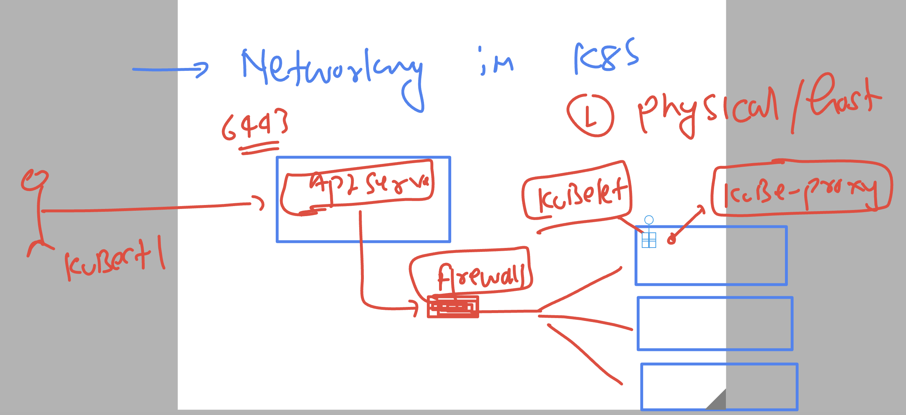
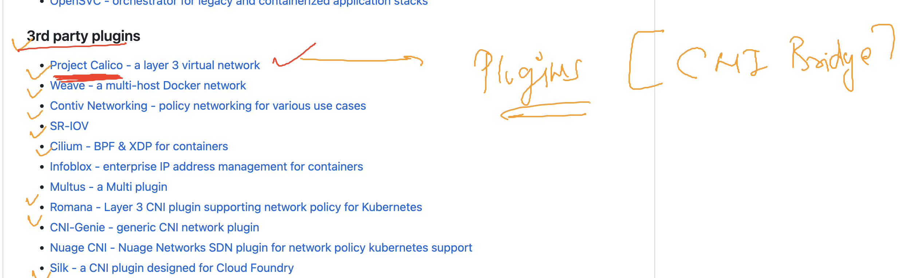

# k8s-cloud4c-b3

### verify connection here

```
[ashu@ip-172-31-5-47 ashu-docker-images]$ kubectl  get  nodes
NAME         STATUS   ROLES           AGE     VERSION
masternode   Ready    control-plane   4d19h   v1.27.3
node1        Ready    <none>          4d19h   v1.27.3
node2        Ready    <none>          4d19h   v1.27.3
node3        Ready    <none>          4d19h   v1.27.3
[ashu@ip-172-31-5-47 ashu-docker-images]$ kubectl  config get-contexts 
CURRENT   NAME                          CLUSTER      AUTHINFO           NAMESPACE
*         kubernetes-admin@kubernetes   kubernetes   kubernetes-admin   ashu-apps
[ashu@ip-172-31-5-47 ashu-docker-images]$ 


```

## Networking in k8s -- 

### node to control plane networking 



### pod to pod networking 


## Testing pod to pod communication using web ui app 

### creating pod manifest 

```
[ashu@ip-172-31-5-47 ashu-docker-images]$ ls
java-app  k8s-manifests  labs.txt  node-app  python-app  webui-app
[ashu@ip-172-31-5-47 ashu-docker-images]$ cd  k8s-manifests/
[ashu@ip-172-31-5-47 k8s-manifests]$ ls
ashupod1.yaml  auto.yaml  mypod.json  ns.yaml
[ashu@ip-172-31-5-47 k8s-manifests]$ kubectl  run ashuwebapp --image=dockerashu/ashuweb-ui:app4 --port 80 --dry-run=client -o yaml >webapp.yaml 
[ashu@ip-172-31-5-47 k8s-manifests]$ 
```

### creating pod and checking networking details

```
[ashu@ip-172-31-5-47 k8s-manifests]$ kubectl  create -f webapp.yaml 
pod/ashuwebapp created
[ashu@ip-172-31-5-47 k8s-manifests]$ kubectl  get pods
NAME         READY   STATUS              RESTARTS   AGE
ashuwebapp   0/1     ContainerCreating   0          2s
[ashu@ip-172-31-5-47 k8s-manifests]$ kubectl  get pods
NAME         READY   STATUS    RESTARTS   AGE
ashuwebapp   1/1     Running   0          12s
[ashu@ip-172-31-5-47 k8s-manifests]$ kubectl  get pods -o wide
NAME         READY   STATUS    RESTARTS   AGE   IP              NODE    NOMINATED NODE   READINESS GATES
ashuwebapp   1/1     Running   0          16s   192.168.135.8   node3   <none>           <none>
[ashu@ip-172-31-5-47 k8s-manifests]$ 


```

### we are using project calico as CNI provider for pod networking 



### checking CNI plugin 

```
[ashu@ip-172-31-5-47 k8s-manifests]$ kubectl   describe pod  ashuwebapp 
Name:             ashuwebapp
Namespace:        ashu-apps
Priority:         0
Service Account:  default
Node:             node3/172.31.0.13
Start Time:       Mon, 24 Jul 2023 04:20:06 +0000
Labels:           run=ashuwebapp
Annotations:      cni.projectcalico.org/containerID: d252ebd68ac942cd207ccebff36ba5fcf88055edfe239f5cdb91449dbae6a5df
                  cni.projectcalico.org/podIP: 192.168.135.8/32
                  cni.projectcalico.org/podIPs: 192.168.135.8/32
Status:           Running
IP:               192.168.135.8
IPs:
  IP:  192.168.135.8
Containers:
```

### sending http request to other pod from my POd 

```
[ashu@ip-172-31-5-47 k8s-manifests]$ kubectl   get  po
NAME         READY   STATUS    RESTARTS   AGE
ashuwebapp   1/1     Running   0          10m
[ashu@ip-172-31-5-47 k8s-manifests]$ 
[ashu@ip-172-31-5-47 k8s-manifests]$ kubectl   exec -it  ashuwebapp -- bash 
root@ashuwebapp:/# 
root@ashuwebapp:/# 
root@ashuwebapp:/# curl  http://192.168.166.129/health.html 
<h1> this is sample page for health check purpose of web app by ashutoshh  </h1>
<h2> adding more health page data  new </h2>
<h3> ashutoshh adding a new change 1st now 2nd  okk change 3  </h3>
root@ashuwebapp:/# 

```

