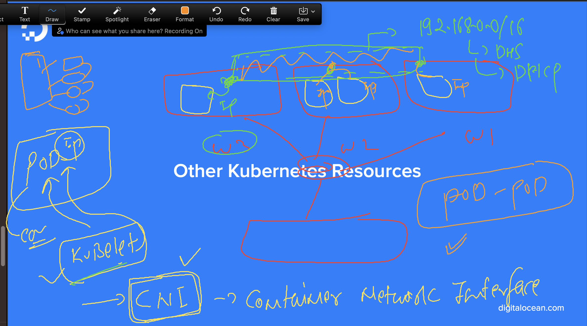

# k8s-cloud4c-b3

### verify connection here

```
[ashu@ip-172-31-5-47 ashu-docker-images]$ kubectl  get  nodes
NAME         STATUS   ROLES           AGE     VERSION
masternode   Ready    control-plane   4d19h   v1.27.3
node1        Ready    <none>          4d19h   v1.27.3
node2        Ready    <none>          4d19h   v1.27.3
node3        Ready    <none>          4d19h   v1.27.3
[ashu@ip-172-31-5-47 ashu-docker-images]$ kubectl  config get-contexts 
CURRENT   NAME                          CLUSTER      AUTHINFO           NAMESPACE
*         kubernetes-admin@kubernetes   kubernetes   kubernetes-admin   ashu-apps
[ashu@ip-172-31-5-47 ashu-docker-images]$ 


```

## Networking in k8s -- 

### node to control plane networking 


### pod to pod networking 




