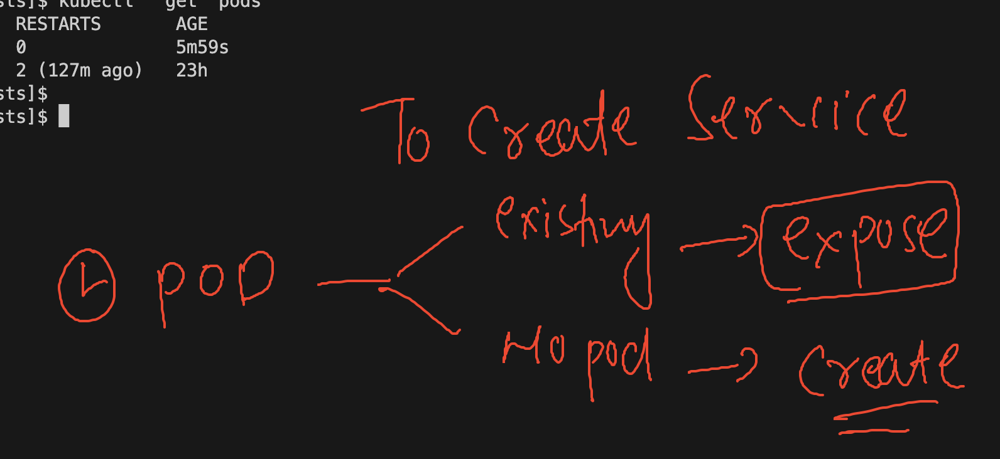
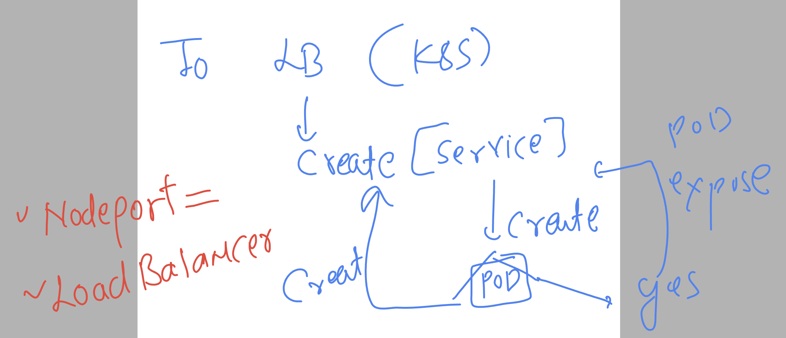
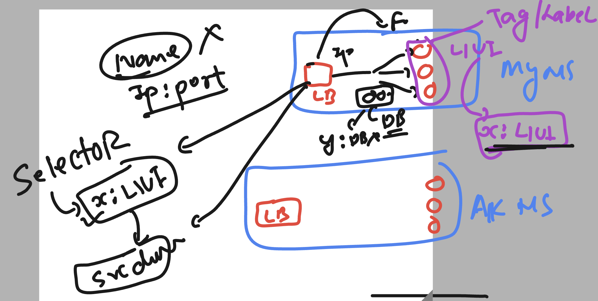

# k8s-cloud4c-b3

### Revision 

##  Creating Dockerfile with sample UI application to build docker image 

### creating a new project directory 
```
[ashu@ip-172-31-5-47 ashu-docker-images]$ mkdir new-webapp
[ashu@ip-172-31-5-47 ashu-docker-images]$ cd new-webapp/
[ashu@ip-172-31-5-47 new-webapp]$ git clone https://github.com/schoolofdevops/html-sample-app.git
Cloning into 'html-sample-app'...
remote: Enumerating objects: 74, done.
remote: Counting objects: 100% (74/74), done.
remote: Compressing objects: 100% (69/69), done.
remote: Total 74 (delta 5), reused 72 (delta 5), pack-reused 0
Receiving objects: 100% (74/74), 1.38 MiB | 3.08 MiB/s, done.
Resolving deltas: 100% (5/5), done.
[ashu@ip-172-31-5-47 new-webapp]$ ls
html-sample-app
[ashu@ip-172-31-5-47 new-webapp]$ 
```

### Dockerfile and .dockerignore adding to the source code

```
html-sample-app/.git
html-sample-app/*.txt
```

### 

```
FROM nginx
LABEL name=ashutoshh
COPY html-sample-app /usr/share/nginx/html/
```

### lets build image  and push image to docker hub 

```
[ashu@ip-172-31-5-47 new-webapp]$ ls
Dockerfile  html-sample-app
[ashu@ip-172-31-5-47 new-webapp]$ 
[ashu@ip-172-31-5-47 new-webapp]$ docker build -t  docker.io/dockerashu/ashu-app:uiv1 . 
Sending build context to Docker daemon  2.099MB
Step 1/3 : FROM nginx
 ---> 021283c8eb95
Step 2/3 : LABEL name=ashutoshh
 ---> Using cache
 ---> d6bf21fa45a3
Step 3/3 : COPY html-sample-app /usr/share/nginx/html/
 ---> 49e6fb96c8eb
Successfully built 49e6fb96c8eb
Successfully tagged dockerashu/ashu-app:uiv1


[ashu@ip-172-31-5-47 new-webapp]$ docker login 
Authenticating with existing credentials...
WARNING! Your password will be stored unencrypted in /home/ashu/.docker/config.json.
Configure a credential helper to remove this warning. See
https://docs.docker.com/engine/reference/commandline/login/#credentials-store

Login Succeeded


[ashu@ip-172-31-5-47 new-webapp]$ docker push docker.io/dockerashu/ashu-app:uiv1
The push refers to repository [docker.io/dockerashu/ashu-app]
23cc067ff78e: Pushed 
3c9d04c9ebd5: Layer already exists 
434c6a715c30: Layer already exists 
9fdfd12bc85b: Layer already exists 
f36897eea34d: Layer already exists 
```

## Deploy image into k8s 

```
[ashu@ip-172-31-5-47 k8s-manifests]$ kubectl  run  ashupod-day7   --image=dockerashu/ashu-app:uiv1 --port 80 --dry-run=client -o yaml  >day7_pod.yaml 
[ashu@ip-172-31-5-47 k8s-manifests]$ ls
ashupod1.yaml  auto.yaml  day7_pod.yaml  mypod.json  nodeportsvc.yaml  ns.yaml  webapp.yaml
[ashu@ip-172-31-5-47 k8s-manifests]$ kubectl  create -f day7_pod.yaml 
pod/ashupod-day7 created
[ashu@ip-172-31-5-47 k8s-manifests]$ kubectl  get  pods
NAME           READY   STATUS              RESTARTS       AGE
ashupod-day7   0/1     ContainerCreating   0              3s
```

### service creation options



### using expose commmand to create service manifest 

```
[ashu@ip-172-31-5-47 k8s-manifests]$ kubectl  get  pods
NAME           READY   STATUS    RESTARTS       AGE
ashupod-day7   1/1     Running   0              8m12s
ashuwebapp     1/1     Running   2 (130m ago)   23h
[ashu@ip-172-31-5-47 k8s-manifests]$ 
[ashu@ip-172-31-5-47 k8s-manifests]$ kubectl  expose pod ashupod-day7  --type NodePort --port 80 --name ashulb7 --dry-run=client -o yaml  >day7svc.yaml 
[ashu@ip-172-31-5-47 k8s-manifests]$ kubectl  create -f day7svc.yaml 
service/ashulb7 created
[ashu@ip-172-31-5-47 k8s-manifests]$ 
[ashu@ip-172-31-5-47 k8s-manifests]$ kubectl   get  svc
NAME      TYPE       CLUSTER-IP       EXTERNAL-IP   PORT(S)        AGE
ashulb    NodePort   10.109.180.49    <none>        80:30736/TCP   22h
ashulb7   NodePort   10.102.210.233   <none>        80:32459/TCP   3s
[ashu@ip-172-31-5-47 k8s-manifests]$ 
```
### service creation conditions 



### creating service using create service request

```
[ashu@ip-172-31-5-47 k8s-manifests]$ kubectl  create  service
Create a service using a specified subcommand.

Aliases:
service, svc

Available Commands:
  clusterip      Create a ClusterIP service
  externalname   Create an ExternalName service
  loadbalancer   Create a LoadBalancer service
  nodeport       Create a NodePort service

Usage:
  kubectl create service [flags] [options]

Use "kubectl <command> --help" for more information about a given command.
Use "kubectl options" for a list of global command-line options (applies to all commands).
[ashu@ip-172-31-5-47 k8s-manifests]$ kubectl  create  service  loadbalancer ashu-lb77  --tcp  80:80 --dry-run=client -o yaml >lbsvc.yaml 
[ashu@ip-172-31-5-47 k8s-manifests]$ kubectl  create -f  lbsvc.yaml 
service/ashu-lb77 created
[ashu@ip-172-31-5-47 k8s-manifests]$ kubectl  get  svc
NAME        TYPE           CLUSTER-IP       EXTERNAL-IP   PORT(S)        AGE
ashu-lb77   LoadBalancer   10.98.157.110    <pending>     80:30782/TCP   3s
ashulb      NodePort       10.109.180.49    <none>        80:30736/TCP   23h
ashulb7     NodePort       10.102.210.233   <none>        80:32459/TCP   16m
[ashu@ip-172-31-5-47 k8s-manifests]$ 
```

### svc finding pods



### checking lable or stamp of the pods

```
[ashu@ip-172-31-5-47 k8s-manifests]$ kubectl   get pods --show-labels 
NAME           READY   STATUS    RESTARTS       AGE   LABELS
ashupod-day7   1/1     Running   0              43m   run=ashupod-day7
ashuwebapp     1/1     Running   2 (164m ago)   24h   run=ashuwebapp
[ashu@ip-172-31-5-47 k8s-manifests]$ 

```

### patching service yaml to change label 

```
apiVersion: v1
kind: Service
metadata:
  creationTimestamp: null
  labels:
    app: ashu-lb77
  name: ashu-lb77
spec:
  ports:
  - name: 80-80
    port: 80
    protocol: TCP
    targetPort: 80
  selector: # pod finder using pod label 
    run: ashupod-day7 # label of my ui pod 
  type: LoadBalancer
status:
  loadBalancer: {}

```

### redeploy service 

```
[ashu@ip-172-31-5-47 k8s-manifests]$ kubectl  replace -f lbsvc.yaml  --force 
service "ashu-lb77" deleted
service/ashu-lb77 replaced
[ashu@ip-172-31-5-47 k8s-manifests]$ kubectl   get  svc
NAME        TYPE           CLUSTER-IP       EXTERNAL-IP   PORT(S)        AGE
ashu-lb77   LoadBalancer   10.111.141.120   <pending>     80:32018/TCP   13s
ashulb      NodePort       10.109.180.49    <none>        80:30736/TCP   23h
ashulb7     NodePort       10.102.210.233   <none>        80:32459/TCP   39m
```


