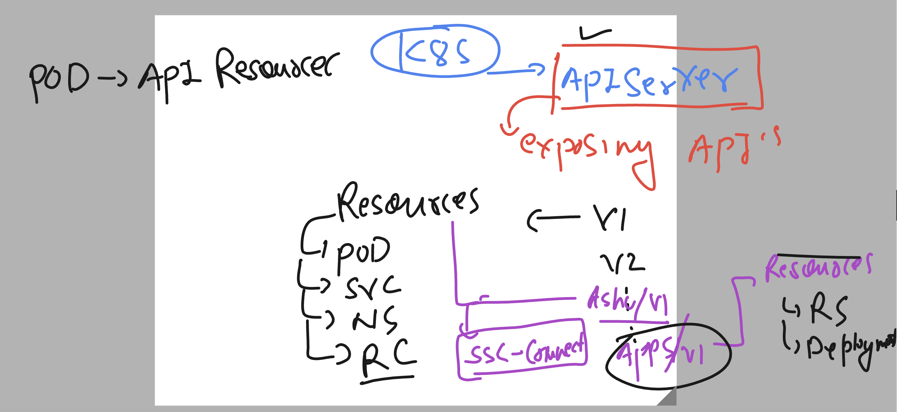

# k8s-cloud4c-b3

### connect

```
[ashu@ip-172-31-5-47 ashu-docker-images]$ kubectl  config  get-contexts 
CURRENT   NAME                          CLUSTER      AUTHINFO           NAMESPACE
*         kubernetes-admin@kubernetes   kubernetes   kubernetes-admin   ashu-apps
[ashu@ip-172-31-5-47 ashu-docker-images]$ kubectl  delete all --all
pod "ashupod1" deleted
[ashu@ip-172-31-5-47 ashu-docker-images]$ 

```

### creating pod using deployment controller 

### understanding apiserver logical desing 



### listing all api-resource in currently running k8s version 

```
[ashu@ip-172-31-5-47 ashu-docker-images]$ kubectl  api-resources 
NAME                              SHORTNAMES   APIVERSION                             NAMESPACED   KIND
bindings                                       v1                                     true         Binding
componentstatuses                 cs           v1                                     false        ComponentStatus
configmaps                        cm           v1                                     true         ConfigMap
endpoints                         ep           v1                                     true         Endpoints
events                            ev           v1                                     true         Event
```

