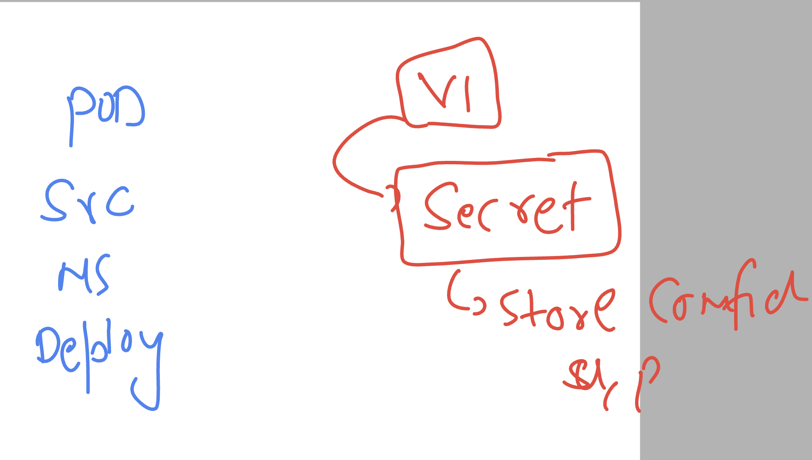
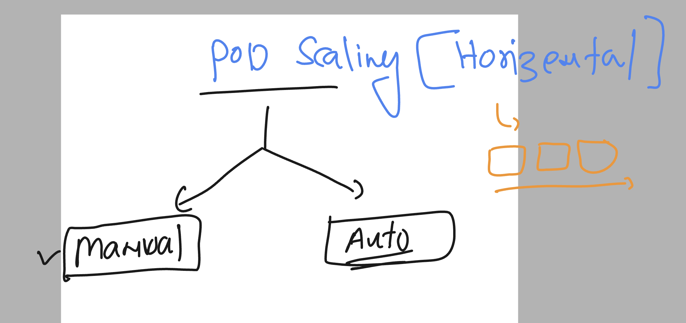

# k8s-cloud4c-b3

### k8s hidden part 1 

### all the component is running under kube-system namespaces

```
[ashu@ip-172-31-5-47 ashu-docker-images]$ kubectl   get  ns  | grep kube
kube-node-lease        Active   7d18h
kube-public            Active   7d18h
kube-system            Active   7d18h
kubernetes-dashboard   Active   2d
[ashu@ip-172-31-5-47 ashu-docker-images]$ kubectl   -n kube-system   get  pods 
NAME                                       READY   STATUS    RESTARTS       AGE
calico-kube-controllers-6c99c8747f-r4ghn   1/1     Running   11 (25m ago)   7d19h
calico-node-hm9dh                          1/1     Running   12 (25m ago)   7d19h
calico-node-j76x4                          1/1     Running   12 (25m ago)   7d19h
calico-node-jlvpf                          1/1     Running   12 (25m ago)   7d19h
calico-node-tbj8x                          1/1     Running   12 (25m ago)   7d19h
```

###  Controllers ---  deploy new image using deployment controller 

### cleaning namespace resources 

```
[ashu@ip-172-31-5-47 ashu-docker-images]$ kubectl config get-contexts 
CURRENT   NAME                          CLUSTER      AUTHINFO           NAMESPACE
*         kubernetes-admin@kubernetes   kubernetes   kubernetes-admin   ashu-apps

[ashu@ip-172-31-5-47 ashu-docker-images]$ kubectl   get  all
NAME                                    READY   STATUS    RESTARTS      AGE
pod/ashu-node-deploy-5f6dbfdd46-wcktm   1/1     Running   2 (42m ago)   22h
pod/ashu-node-deploy-5f6dbfdd46-xwxdk   1/1     Running   2 (42m ago)   22h
pod/ashu-node-deploy-5f6dbfdd46-zzwk8   1/1     Running   2 (42m ago)   22h

NAME                       TYPE       CLUSTER-IP      EXTERNAL-IP   PORT(S)          AGE
service/ashu-node-deploy   NodePort   10.110.139.93   <none>        3000:32134/TCP   22h

NAME                               READY   UP-TO-DATE   AVAILABLE   AGE
deployment.apps/ashu-node-deploy   3/3     3            3           22h

NAME                                          DESIRED   CURRENT   READY   AGE
replicaset.apps/ashu-node-deploy-5f6dbfdd46   3         3         3       22h


[ashu@ip-172-31-5-47 ashu-docker-images]$ kubectl  delete all --all
pod "ashu-node-deploy-5f6dbfdd46-wcktm" deleted
pod "ashu-node-deploy-5f6dbfdd46-xwxdk" deleted
pod "ashu-node-deploy-5f6dbfdd46-zzwk8" deleted
service "ashu-node-deploy" deleted
```

### testing of creation of pod using private image registry 

```
ashu@ip-172-31-5-47 ashu-docker-images]$ kubectl  run  ashupod1 --image=cloud4c.azurecr.io/reactjs:v1.1 --port 3000 
pod/ashupod1 created

[ashu@ip-172-31-5-47 ashu-docker-images]$ kubectl   get  pods
NAME       READY   STATUS             RESTARTS   AGE
ashupod1   0/1     ImagePullBackOff   0          9s
[ashu@ip-172-31-5-47 ashu-docker-images]$ 

```

### checking events for reason purpose 

```
[ashu@ip-172-31-5-47 ashu-docker-images]$ kubectl   get  events  |  grep error
2m55s       Warning   Failed                   pod/ashupod1                             Failed to pull image "cloud4c.azurecr.io/reactjs:v1.1": rpc error: code = Unknown desc = failed to pull and unpack image "cloud4c.azurecr.io/reactjs:v1.1": failed to resolve reference "cloud4c.azurecr.io/reactjs:v1.1": failed to authorize: failed to fetch anonymous token: unexpected status: 401 Unauthorized
[ashu@ip-172-31-5-47 ashu-docker-imag
```

### using secret to store any confidential info in k8s then use by pod or controlles



### creating secret 

```
[ashu@ip-172-31-5-47 ashu-docker-images]$ kubectl   create secret 
Create a secret using specified subcommand.

Available Commands:
  docker-registry   Create a secret for use with a Docker registry
  generic           Create a secret from a local file, directory, or literal value
  tls               Create a TLS secret

Usage:
  kubectl create secret [flags] [options]

Use "kubectl <command> --help" for more information about a given command.
Use "kubectl options" for a list of global command-line options (applies to all commands).

[ashu@ip-172-31-5-47 ashu-docker-images]$ kubectl   create secret  docker-registry  ashu-cred --docker-server="cloud4c.azurecr.io" --docker-username="cloud4c"  --docker-password="iFTcesAY+ACRAdtpmj"  
secret/ashu-cred created
[ashu@ip-172-31-5-47 ashu-docker-images]$ kubectl  get  secret
NAME        TYPE                             DATA   AGE
ashu-cred   kubernetes.io/dockerconfigjson   1      9s
[ashu@ip-172-31-5-47 ashu-docker-images]$ 


```

### creating pod manifest

```
kubectl  run  ashupod1 --image=cloud4c.azurecr.io/reactjs:v1.1 --port 3000   --dry-run=client -o yaml >day9pod.yaml
```

### updating manifest to use secret 

```
apiVersion: v1
kind: Pod
metadata:
  creationTimestamp: null
  labels:
    run: ashupod1
  name: ashupod1
spec:
  imagePullSecrets: # to call secret 
  - name: ashu-cred # name of secret resource 
  containers:
  - image: cloud4c.azurecr.io/reactjs:v1.1
    name: ashupod1
    ports:
    - containerPort: 3000
    resources: {}
  dnsPolicy: ClusterFirst
  restartPolicy: Always
status: {}

```

### deploy it

```
[ashu@ip-172-31-5-47 k8s-manifests]$ kubectl  create -f  day9pod.yaml 
pod/ashupod1 created
[ashu@ip-172-31-5-47 k8s-manifests]$ kubectl  get  pods
NAME       READY   STATUS              RESTARTS   AGE
ashupod1   0/1     ContainerCreating   0          3s
[ashu@ip-172-31-5-47 k8s-manifests]$ kubectl  get  pods
NAME       READY   STATUS    RESTARTS   AGE
ashupod1   1/1     Running   0          46s
```

### best way to deploy a container image using deployment not using pod 

```
kubectl  create deployment  ashu-react-app --image=cloud4c.azurecr.io/reactjs:v1.1 --port 3000 --dry-run=client -o yaml  >day9_deployment.yaml 
```

### call secret in deployment manifest file

```
apiVersion: apps/v1
kind: Deployment
metadata:
  creationTimestamp: null
  labels:
    app: ashu-react-app
  name: ashu-react-app
spec:
  replicas: 1
  selector:
    matchLabels:
      app: ashu-react-app
  strategy: {}
  template: # used by deployment to create pods 
    metadata:
      creationTimestamp: null
      labels:
        app: ashu-react-app
    spec:
      imagePullSecrets: # calling secret 
      - name: ashu-cred  # name of secret
      containers:
      - image: cloud4c.azurecr.io/reactjs:v1.1
        name: reactjs
        ports:
        - containerPort: 3000
        resources: {}
status: {}

```

### deploy it 

```
[ashu@ip-172-31-5-47 k8s-manifests]$ kubectl  create -f day9_deployment.yaml 
deployment.apps/ashu-react-app created

[ashu@ip-172-31-5-47 k8s-manifests]$ kubectl  get deploy
NAME             READY   UP-TO-DATE   AVAILABLE   AGE
ashu-react-app   1/1     1            1           3s

[ashu@ip-172-31-5-47 k8s-manifests]$ kubectl  get rs
NAME                        DESIRED   CURRENT   READY   AGE
ashu-react-app-5459dcbbf7   1         1         1       6s

[ashu@ip-172-31-5-47 k8s-manifests]$ kubectl  get po
NAME                              READY   STATUS    RESTARTS   AGE
ashu-react-app-5459dcbbf7-sm8p5   1/1     Running   0          9s
[ashu@ip-172-31-5-47 k8s-manifests]$ 

```

### creating loadbalnacer/nodeport service using expose of deployment 

```
[ashu@ip-172-31-5-47 k8s-manifests]$ kubectl   get  deploy
NAME             READY   UP-TO-DATE   AVAILABLE   AGE
ashu-react-app   1/1     1            1           8m32s
[ashu@ip-172-31-5-47 k8s-manifests]$ kubectl   expose  deployment  ashu-react-app  --type  LoadBalancer  --port 3000 --name ashulb1 --dry-run=client -o yaml >lbday9.yaml
[ashu@ip-172-31-5-47 k8s-manifests]$ kubectl  create -f lbday9.yaml 
service/ashulb1 created
[ashu@ip-172-31-5-47 k8s-manifests]$ kubectl  get  svc
NAME      TYPE           CLUSTER-IP     EXTERNAL-IP   PORT(S)          AGE
ashulb1   LoadBalancer   10.97.60.145   <pending>     3000:32701/TCP   4s
[ashu@ip-172-31-5-47 k8s-manifests]$ 

```

### scaling pod 



### scaling pod manually without changing manifest file

```
[ashu@ip-172-31-5-47 k8s-manifests]$ kubectl   get  deploy
NAME             READY   UP-TO-DATE   AVAILABLE   AGE
ashu-react-app   1/1     1            1           16m

[ashu@ip-172-31-5-47 k8s-manifests]$ kubectl  scale  deployment   ashu-react-app --replicas 4
deployment.apps/ashu-react-app scaled

[ashu@ip-172-31-5-47 k8s-manifests]$ kubectl   get  deploy
NAME             READY   UP-TO-DATE   AVAILABLE   AGE
ashu-react-app   3/4     4            3           17m

[ashu@ip-172-31-5-47 k8s-manifests]$ kubectl   get  po
NAME                              READY   STATUS    RESTARTS   AGE
ashu-react-app-5459dcbbf7-7c4bj   1/1     Running   0          22s
ashu-react-app-5459dcbbf7-gcz6s   1/1     Running   0          22s
ashu-react-app-5459dcbbf7-sm8p5   1/1     Running   0          17m
ashu-react-app-5459dcbbf7-x68fn   1/1     Running   0          22s
[ashu@ip-172-31-5-47 k8s-manifests]$ kubectl   get  deploy
NAME             READY   UP-TO-DATE   AVAILABLE   AGE
ashu-react-app   4/4     4            4           17m
[ashu@ip-172-31-5-47 k8s-manifests]$ 

```

### Using chatGPt based solution 

```
[ashu@ip-172-31-5-47 tasks]$ kubectl  create -f svcng.yaml 
service/nginx-service created
[ashu@ip-172-31-5-47 tasks]$ kubectl  get po
NAME          READY   STATUS    RESTARTS   AGE
[ashu@ip-172-31-5-47 tasks]$ 
[ashu@ip-172-31-5-47 tasks]$ 
[ashu@ip-172-31-5-47 tasks]$ kubectl  get po --show-labels 
NAME          READY   STATUS    RESTARTS   AGE     LABELS
busybox-pod   1/1     Running   0          6m32s   <none>
nginx-pod     1/1     Running   0          3m38s   delvex=ashup11
[ashu@ip-172-31-5-47 tasks]$ 
[ashu@ip-172-31-5-47 tasks]$ 
[ashu@ip-172-31-5-47 tasks]$ kubectl  get svc -o wide
NAME            TYPE        CLUSTER-IP      EXTERNAL-IP   PORT(S)   AGE   SELECTOR
nginx-service   ClusterIP   10.99.186.237   <none>        80/TCP    84s   delvex=ashup11
[ashu@ip-172-31-5-47 tasks]$ 
[ashu@ip-172-31-5-47 tasks]$ 
[ashu@ip-172-31-5-47 tasks]$ kubectl  get  endpoints 
NAME            ENDPOINTS           AGE
nginx-service   192.168.135.16:80   103s
[ashu@ip-172-31-5-47 tasks]$ kubectl  get po nginx-pod -o wide
NAME        READY   STATUS    RESTARTS   AGE     IP               NODE    NOMINATED NODE   READINESS GATES
nginx-pod   1/1     Running   0          4m11s   192.168.135.16   node3   <none>           <none>
[ashu@ip-172-31-5-47 tasks]$ kubectl  exec -it busybox-pod -- sh 
/ # 
/ # wget  http://10.99.186.237
Connecting to 10.99.186.237 (10.99.186.237:80)
saving to 'index.html'
index.html           100% |******************************************************************************|   615  0:00:00 ETA
'index.html' saved
/ # wget  http://10.99.186.237 -o /tmp/mypage.txt
/ # cat /tmp/mypage.txt 
Connecting to 10.99.186.237 (10.99.186.237:80)
```


